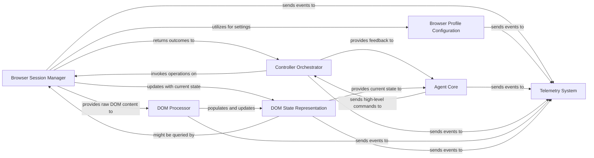

## Component Details

The `Browser Automation` subsystem is designed to provide a robust and flexible interface for an AI agent to interact with web browsers. It encapsulates all the complexities of browser management, DOM processing, and action execution, presenting a simplified view to the `Agent Core`. The chosen components are fundamental because they represent distinct, cohesive responsibilities essential for enabling intelligent web interaction.

### Browser Session Manager
This component is the orchestrator of browser instances and their contexts. It handles the lifecycle of browser sessions, including launching new browsers, connecting to existing ones, and managing individual pages or tabs. It provides the primary interface for direct browser interactions such as navigation, screenshot capture, and raw DOM retrieval.

**Related Classes/Methods**:

- <a href="https://github.com/browser-use/browser-use/blob/master/browser_use/browser/session.py#L0-L0" target="_blank" rel="noopener noreferrer">`browser_use.browser.session` (0:0)</a>
- <a href="https://github.com/browser-use/browser-use/blob/master/browser_use/browser/browser.py#L0-L0" target="_blank" rel="noopener noreferrer">`browser_use.browser.browser` (0:0)</a>
- <a href="https://github.com/browser-use/browser-use/blob/master/browser_use/browser/context.py#L0-L0" target="_blank" rel="noopener noreferrer">`browser_use.browser.context` (0:0)</a>

### Browser Profile Configuration
This component is responsible for defining and applying various configuration settings for browser instances. This includes user profile settings, context arguments (e.g., color schemes, content recording), and launch parameters, ensuring the browser operates in a desired environment.

**Related Classes/Methods**:

- <a href="https://github.com/browser-use/browser-use/blob/master/browser_use/browser/profile.py#L0-L0" target="_blank" rel="noopener noreferrer">`browser_use.browser.profile` (0:0)</a>

### DOM Processor
This component specializes in analyzing and transforming the raw Document Object Model (DOM) of a web page into a more structured and actionable format. It identifies interactive elements, extracts relevant information, and can manage navigation history to build a comprehensive understanding of the page's structure and state.

**Related Classes/Methods**:

- <a href="https://github.com/browser-use/browser-use/blob/master/browser_use/dom/service.py#L0-L0" target="_blank" rel="noopener noreferrer">`browser_use.dom.service` (0:0)</a>
- <a href="https://github.com/browser-use/browser-use/blob/master/browser_use/dom/clickable_element_processor/service.py#L0-L0" target="_blank" rel="noopener noreferrer">`browser_use.dom.clickable_element_processor.service` (0:0)</a>
- <a href="https://github.com/browser-use/browser-use/blob/master/browser_use/dom/history_tree_processor/service.py#L0-L0" target="_blank" rel="noopener noreferrer">`browser_use.dom.history_tree_processor.service` (0:0)</a>

### DOM State Representation
This component provides a simplified, structured, and actionable representation of the current state of the web page's DOM, combined with summarized browser state information. It acts as the "world model" for the agent, containing details about visible elements, their properties, and relationships, enabling informed decision-making.

**Related Classes/Methods**:

- <a href="https://github.com/browser-use/browser-use/blob/master/browser_use/dom/views.py#L0-L0" target="_blank" rel="noopener noreferrer">`browser_use.dom.views` (0:0)</a>
- <a href="https://github.com/browser-use/browser-use/blob/master/browser_use/browser/views.py#L0-L0" target="_blank" rel="noopener noreferrer">`browser_use.browser.views` (0:0)</a>

### Controller Orchestrator
This component acts as an intermediary, translating high-level commands from the `Agent Core` into specific, low-level browser operations. It manages the registration and dispatch of various browser-related commands, ensuring proper execution flow and error handling.

**Related Classes/Methods**:

- <a href="https://github.com/browser-use/browser-use/blob/master/browser_use/controller/service.py#L0-L0" target="_blank" rel="noopener noreferrer">`browser_use.controller.service` (0:0)</a>
- <a href="https://github.com/browser-use/browser-use/blob/master/browser_use/controller/registry/service.py#L0-L0" target="_blank" rel="noopener noreferrer">`browser_use.controller.registry.service` (0:0)</a>

### Agent Core
This is the "brain" of the overall system. It encapsulates the AI agent's decision-making logic, planning capabilities, and the generation of high-level actions based on its understanding of the current web page state (provided by `DOM State Representation`). It sends these high-level commands to the `Controller Orchestrator`.

**Related Classes/Methods**:

- `browser_use.agent` (0:0)

### Telemetry System
This component is responsible for collecting, logging, and reporting various events and metrics throughout the system. This includes agent actions, browser interactions, errors, and performance data, crucial for monitoring, debugging, and analysis of the automation process.

**Related Classes/Methods**:

- <a href="https://github.com/browser-use/browser-use/blob/master/browser_use/telemetry/service.py#L0-L0" target="_blank" rel="noopener noreferrer">`browser_use.telemetry.service` (0:0)</a>
- <a href="https://github.com/browser-use/browser-use/blob/master/browser_use/telemetry/views.py#L0-L0" target="_blank" rel="noopener noreferrer">`browser_use.telemetry.views` (0:0)</a>

### [FAQ](https://github.com/CodeBoarding/GeneratedOnBoardings/tree/main?tab=readme-ov-file#faq)