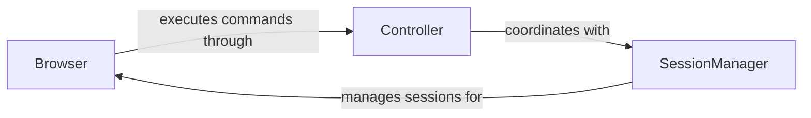

## Details

Browser automation system with core components for browser management, command execution, and session handling. The architecture enables programmatic control of browser instances through a layered approach where the Browser component coordinates with Controller for command execution and SessionManager for context management.

### Browser
Manages browser instances, DOM manipulation, and page navigation. Provides high-level API for browser automation operations.

**Related Classes/Methods**:

- `browser_use.browser.BrowserCore` (78:312)
- `browser_use.core.browser.Browser` (15:250)
- `browser_use.core.browser.PageManager` (45:180)

### Controller
Processes and executes browser control commands. Handles command routing and error recovery for automation workflows.

**Related Classes/Methods**:

- `browser_use.controller.Controller` (12:200)

### SessionManager
Manages browser session lifecycle, context persistence, and session state tracking across automation operations.

**Related Classes/Methods**:

- `browser_use.session.SessionManager` (30:150)

### [FAQ](https://github.com/CodeBoarding/GeneratedOnBoardings/tree/main?tab=readme-ov-file#faq)