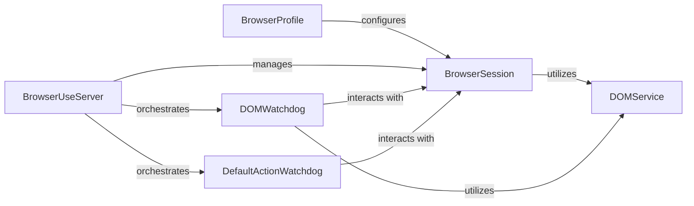

## Details

The Browser Automation Module is a self-contained subsystem responsible for all browser interactions within the project. It leverages Playwright for low-level control and provides a structured interface for AI agents to interact with web pages.

### BrowserSession
Manages the lifecycle of a browser instance, including launching, closing, tab management (creation, switching, closing), URL navigation, and direct low-level communication with the browser via Playwright's CDP (Chrome DevTools Protocol) capabilities. It is the primary interface for direct browser control.

**Related Classes/Methods**:

- <a href="https://github.com/browser-use/browser-use/blob/main/browser_use/browser/session.py#L166-L1722" target="_blank" rel="noopener noreferrer">`BrowserSession`:166-1722</a>

### DOMService
Extracts, processes, and provides a structured, enhanced representation of the Document Object Model (DOM) of web pages, including accessibility information. It acts as the authoritative source for the current state and content of the web page.

**Related Classes/Methods**:

- <a href="https://github.com/browser-use/browser-use/blob/main/browser_use/dom/service.py#L34-L546" target="_blank" rel="noopener noreferrer">`DOMService`:34-546</a>

### BrowserUseServer
Serves as the Multi-Component Protocol (MCP) server endpoint for external requests related to browser automation. It receives high-level commands (e.g., navigate, click, type) from an AI Agent or other clients and translates them into calls to the underlying BrowserSession and other components. It initializes and manages BrowserSession instances.

**Related Classes/Methods**:

- <a href="https://github.com/browser-use/browser-use/blob/main/browser_use/mcp/server.py#L173-L821" target="_blank" rel="noopener noreferrer">`BrowserUseServer`:173-821</a>

### DOMWatchdog
Monitors and responds to browser events related to the DOM and page state, such as network stability, page load completion, and DOM mutations. It ensures that the DOMService has the most current information and provides mechanisms for waiting on specific page conditions.

**Related Classes/Methods**:

- <a href="https://github.com/browser-use/browser-use/blob/main/browser_use/browser/dom_watchdog.py#L24-L584" target="_blank" rel="noopener noreferrer">`DOMWatchdog`:24-584</a>

### DefaultActionWatchdog
Implements the default execution logic for common user interactions within the browser, such as clicking elements, typing text into input fields, scrolling, and handling file uploads. It provides a standardized way to perform these actions.

**Related Classes/Methods**:

- <a href="https://github.com/browser-use/browser-use/blob/main/browser_use/browser/default_action_watchdog.py#L31-L1196" target="_blank" rel="noopener noreferrer">`DefaultActionWatchdog`:31-1196</a>

### BrowserProfile
Manages browser-specific configurations, including launch arguments, user data directories, and browser extensions. It prepares the environment for a BrowserSession to ensure consistent and customized browser behavior.

**Related Classes/Methods**:

- <a href="https://github.com/browser-use/browser-use/blob/main/browser_use/browser/profile.py#L539-L964" target="_blank" rel="noopener noreferrer">`BrowserProfile`:539-964</a>

### [FAQ](https://github.com/CodeBoarding/GeneratedOnBoardings/tree/main?tab=readme-ov-file#faq)