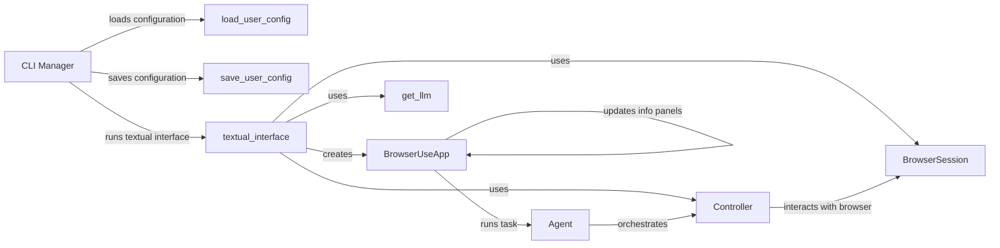

## Component Details

The application's main flow begins with the CLI Manager, which handles command-line arguments and loads user configurations. It then initializes the Textual interface, which creates the BrowserUseApp. The BrowserUseApp manages the display and orchestrates tasks by using the Agent. The Agent uses the Controller to interact with the BrowserSession and the language model. The Controller orchestrates the interaction between the agent, browser, and language model. The application allows users to interact with a browser through a textual interface, automating tasks and displaying information.

### CLI Manager
The CLI Manager handles command-line arguments, configuration loading/saving, and initialization of the Textual interface. It acts as the entry point for the application, managing the user interface and configuration settings.
- **Related Classes/Methods**: `browser-use.browser_use.cli`

### BrowserUseApp
The main Textual application class. It handles user input, manages the display of information panels, and orchestrates the execution of tasks. It uses the Agent to run tasks and updates the UI based on the Agent's progress.
- **Related Classes/Methods**: `browser-use.browser_use.cli.BrowserUseApp`

### Agent
The agent service responsible for managing and running tasks. It interacts with the browser and the language model to execute the tasks. It receives tasks from the BrowserUseApp and uses the Controller to orchestrate the browser and language model interactions.
- **Related Classes/Methods**: `browser-use.agent.service.Agent`

### BrowserSession
Manages the browser session, providing an interface for interacting with the browser. It is used by the Controller to perform browser actions.
- **Related Classes/Methods**: `browser-use.browser.session.BrowserSession`

### Controller
The controller service that orchestrates the interaction between the agent, browser, and language model. It uses the BrowserSession to interact with the browser and the language model to generate actions.
- **Related Classes/Methods**: `browser-use.controller.service.Controller`

### load_user_config
Loads the user configuration from a file. It is called by the CLI Manager to load the user's settings.
- **Related Classes/Methods**: `browser-use.browser_use.cli:load_user_config`

### save_user_config
Saves the user configuration to a file. It is called by the CLI Manager to save the user's settings.
- **Related Classes/Methods**: `browser-use.browser_use.cli:save_user_config`

### textual_interface
Sets up and runs the Textual interface. It creates the BrowserUseApp and initializes the BrowserSession, Controller, and language model.
- **Related Classes/Methods**: `browser-use.browser_use.cli:textual_interface`

### get_llm
Retrieves the language model. It is called by the textual_interface to initialize the language model.
- **Related Classes/Methods**: `browser-use.browser_use.cli:get_llm`