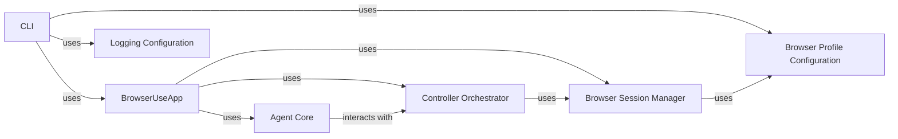

## Component Details

The `CLI` component serves as the primary entry point for the `browser-use` application. It is responsible for initializing the application environment, parsing user input, managing the application's lifecycle, and orchestrating interactions between core functional components. It supports both a Textual-based terminal user interface (TUI) and a direct prompt mode.

### CLI
The top-level script and entry point (`__main__`) that initiates the `browser-use` application. It handles initial argument parsing, sets up the environment, and launches the `BrowserUseApp` to manage the main application loop.

**Related Classes/Methods**:

- <a href="https://github.com/browser-use/browser-use/blob/master/browser_use/cli.py#L0-L0" target="_blank" rel="noopener noreferrer">`browser_use/cli.py` (0:0)</a>

### BrowserUseApp
The core application class that encapsulates the main operational logic of the CLI. It manages the application's state, handles user input (from TUI or prompt), and coordinates the flow between the `Browser Session Manager`, `Agent Core`, and `Controller Orchestrator`.

**Related Classes/Methods**:

- <a href="https://github.com/browser-use/browser-use/blob/master/browser_use/cli.py#L0-L0" target="_blank" rel="noopener noreferrer">`browser_use/cli.py` (0:0)</a>

### Browser Session Manager
Responsible for managing the lifecycle of the browser instance. This includes launching, connecting to, navigating, and interacting with web pages. It provides an abstraction layer for other components to control the browser.

**Related Classes/Methods**:

- <a href="https://github.com/browser-use/browser-use/blob/master/browser_use/browser/session.py#L0-L0" target="_blank" rel="noopener noreferrer">`browser_use/browser/session.py` (0:0)</a>

### Agent Core
Contains the artificial intelligence logic that processes observations from the browser, interprets user commands, and generates a sequence of actions or decisions to achieve a goal. It acts as the "brain" of the automated browsing.

**Related Classes/Methods**:

- `browser_use/agent.py` (0:0)

### Controller Orchestrator
Acts as an intermediary, translating high-level commands or agent-generated actions into specific, executable operations. It orchestrates the flow of control, delegating tasks to the appropriate components, such as the `Browser Session Manager`.

**Related Classes/Methods**:

- `browser_use/controller.py` (0:0)

### Browser Profile Configuration
Manages the loading, saving, and application of various browser-specific configurations and profiles. This includes settings like launch arguments, context preferences, and persistent data, ensuring consistent browser behavior.

**Related Classes/Methods**:

- <a href="https://github.com/browser-use/browser-use/blob/master/browser_use/browser/profile.py#L0-L0" target="_blank" rel="noopener noreferrer">`browser_use/browser/profile.py` (0:0)</a>

### Logging Configuration
Provides a centralized mechanism for configuring the application's logging system. It ensures consistent log output formats, levels, and destinations across all modules, aiding in debugging and monitoring.

**Related Classes/Methods**:

- <a href="https://github.com/browser-use/browser-use/blob/master/browser_use/logging_config.py#L0-L0" target="_blank" rel="noopener noreferrer">`browser_use/logging_config.py` (0:0)</a>

### [FAQ](https://github.com/CodeBoarding/GeneratedOnBoardings/tree/main?tab=readme-ov-file#faq)