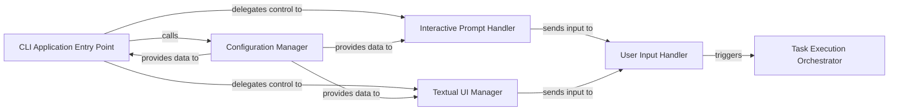

## Details

The browser-use CLI application provides a command-line interface for interacting with a browser automation agent. Its architecture is centered around a CLI Application Entry Point that dispatches control to either an Interactive Prompt Handler or a Textual UI Manager based on user arguments. A dedicated Configuration Manager handles persistent settings, loading and saving application-wide preferences. Both the interactive prompt and the Textual UI utilize a User Input Handler to process user commands. These commands are then passed to a Task Execution Orchestrator, which delegates the actual browser automation tasks to the core agent.

### CLI Application Entry Point
Acts as the main orchestrator for the CLI application. It handles initial setup, parses command-line arguments, loads and saves user configuration, and dispatches control to the appropriate interaction mode (interactive prompt or Textual TUI).

**Related Classes/Methods**: _None_

### Configuration Manager
Handles the loading and persistence of application-wide user configuration settings, ensuring that preferences and operational parameters are maintained across sessions.

**Related Classes/Methods**: _None_

### Interactive Prompt Handler
Manages the traditional, line-by-line command-line interaction flow, allowing users to input commands and receive immediate textual feedback.

**Related Classes/Methods**: _None_

### Textual UI Manager
Initializes and manages the rich terminal user interface (TUI) using the Textual framework. It provides a more interactive and visually organized experience, including updating information panels.

**Related Classes/Methods**: _None_

### User Input Handler
Processes user commands and inputs received from either the interactive prompt or the Textual TUI. It acts as a dispatcher, triggering the execution of tasks based on the parsed input.

**Related Classes/Methods**: _None_

### Task Execution Orchestrator
Takes a user-defined task (received from the User Input Handler) and orchestrates its execution. This component is the primary interface for the CLI to interact with the core Agent or Controller to delegate browser automation or other agent-driven actions.

**Related Classes/Methods**: _None_

### [FAQ](https://github.com/CodeBoarding/GeneratedOnBoardings/tree/main?tab=readme-ov-file#faq)