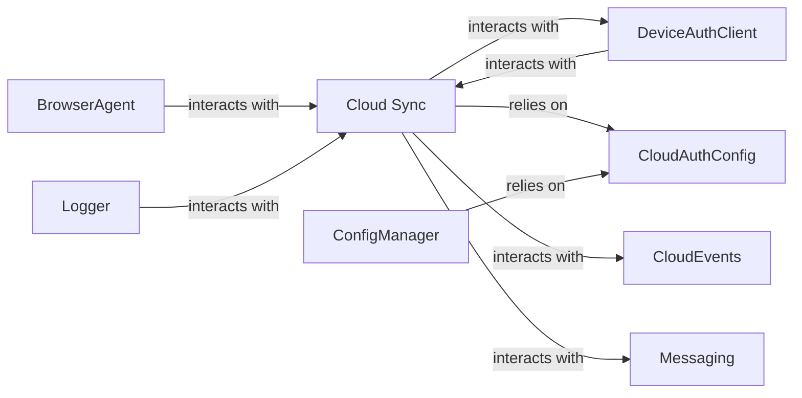

## Details

One paragraph explaining the functionality which is represented by this graph. What the main flow is and what is its purpose.

### Cloud Sync [[Expand]](./Cloud_Sync.md)
Responsible for synchronizing data between the local system and the cloud.

**Related Classes/Methods**:

- `langchain.tools.tool` (1:100)

### DeviceAuthClient
Manages device authentication and authorization.

**Related Classes/Methods**:

- `langchain_core.output_parsers.JsonOutputParser` (1:100)

### CloudAuthConfig
Stores and manages cloud authentication configuration.

**Related Classes/Methods**:

- `langchain_core.output_parsers.JsonOutputParser:parse` (1:100)

### BrowserAgent
Responsible for automating browser interactions and testing.

**Related Classes/Methods**:

- `langchain.tools.tool` (1:100)

### CloudEvents
Manages cloud events and notifications.

**Related Classes/Methods**:

- `langchain_core.output_parsers.JsonOutputParser` (1:100)

### Messaging
Responsible for handling messaging and communication between components.

**Related Classes/Methods**:

- `langchain_core.output_parsers.JsonOutputParser:parse` (1:100)

### ConfigManager
Stores and manages application configuration.

**Related Classes/Methods**:

- `langchain.tools.tool` (1:100)

### Logger
Responsible for logging and monitoring application activity.

**Related Classes/Methods**:

- `langchain_core.output_parsers.JsonOutputParser` (1:100)

### [FAQ](https://github.com/CodeBoarding/GeneratedOnBoardings/tree/main?tab=readme-ov-file#faq)