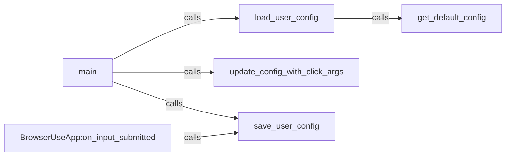

## Component Details

The Configuration Management component handles the loading, updating, and saving of user configuration settings for the browser automation system. It ensures that the system can be tailored to individual user needs and preferences by allowing users to customize settings such as API keys and browser preferences. The component orchestrates the flow from loading the initial configuration (either from a user file or defaults), updating it with command-line arguments, and saving the modified configuration back to a file.

### load_user_config
Loads the user configuration from a specified file. If the file does not exist, it falls back to loading the default configuration. This component is responsible for handling file I/O and parsing the configuration data.
- **Related Classes/Methods**: `browser-use.browser_use.cli:load_user_config`

### get_default_config
Provides the default configuration settings for the application. This is used when no user-specific configuration file is found. It defines the baseline settings for the application.
- **Related Classes/Methods**: `browser-use.browser_use.cli:get_default_config`

### save_user_config
Saves the current user configuration to a file. This persists any changes made during the application's execution, ensuring that the user's settings are retained across sessions. It handles the file I/O operations required to write the configuration data.
- **Related Classes/Methods**: `browser-use.browser_use.cli:save_user_config`

### update_config_with_click_args
Updates the configuration with arguments provided through the Click command-line interface. This allows users to override settings directly from the command line, providing a flexible way to customize the application's behavior.
- **Related Classes/Methods**: `browser-use.browser_use.cli:update_config_with_click_args`

### main
The main entry point of the CLI application. It orchestrates the loading, updating, and saving of the configuration, acting as the central control point for the configuration management process. It calls the other configuration-related components to perform their respective tasks.
- **Related Classes/Methods**: `browser-use.browser_use.cli:main`

### BrowserUseApp:on_input_submitted
Handles user input submitted through the application's interface and triggers saving the configuration. This ensures that changes made through the UI are persisted.
- **Related Classes/Methods**: `browser-use.browser_use.cli.BrowserUseApp:on_input_submitted`