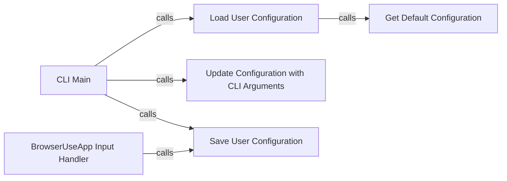

## Component Details

The Configuration Manager is responsible for managing the application's settings, including loading, updating, and saving user configurations. The main flow involves loading the default configuration, updating it with user-provided arguments from the command line, and saving the configuration for future use. This ensures that the application can adapt to different user preferences and environments.

### CLI Main
The main entry point of the CLI application. It orchestrates the loading, updating, and saving of user configurations by calling the relevant functions.
- **Related Classes/Methods**: `browser-use.browser_use.cli:main`

### Load User Configuration
Loads the user configuration from a file if it exists, otherwise loads the default configuration. This component ensures that the application starts with either the user's saved settings or the default settings.
- **Related Classes/Methods**: `browser-use.browser_use.cli:load_user_config`

### Get Default Configuration
Provides the default configuration settings for the application. This component defines the initial settings that are used if no user configuration is found.
- **Related Classes/Methods**: `browser-use.browser_use.cli:get_default_config`

### Update Configuration with CLI Arguments
Updates the configuration with arguments provided through the Click command-line interface. This component allows users to customize the application's behavior through command-line options.
- **Related Classes/Methods**: `browser-use.browser_use.cli:update_config_with_click_args`

### Save User Configuration
Saves the user configuration to a file, persisting the settings for future use. This component ensures that the user's settings are saved and can be loaded the next time the application is run.
- **Related Classes/Methods**: `browser-use.browser_use.cli:save_user_config`

### BrowserUseApp Input Handler
Handles input submitted by the user, potentially triggering actions and saving the user configuration. This component allows the user to interact with the application and modify settings during runtime.
- **Related Classes/Methods**: `browser-use.browser_use.cli.BrowserUseApp:on_input_submitted`