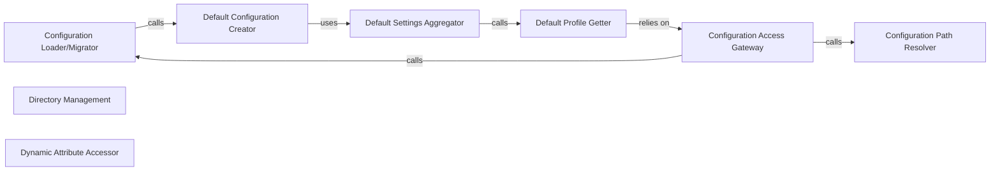

## Details

The Configuration Management subsystem, primarily encapsulated within browser_use.config, is responsible for the entire lifecycle of application configurations. This includes initial setup, loading, migration across versions, and providing structured access to settings for LLMs, browser profiles, and agent behaviors.

### Configuration Loader/Migrator
Manages the lifecycle of the configuration file, including its initial creation, loading from disk, and migration to newer versions if necessary. It ensures the application always operates with a valid and current configuration.

**Related Classes/Methods**:

- <a href="https://github.com/browser-use/browser-use/blob/main/browser_use/config.py#L284-L327" target="_blank" rel="noopener noreferrer">`browser_use.config.load_and_migrate_config`:284-327</a>

### Configuration Access Gateway
Serves as the authoritative gateway for accessing the project's configuration data. It ensures that the configuration is properly loaded and migrated before returning it, acting as the primary interface for other parts of the application to retrieve settings.

**Related Classes/Methods**:

- <a href="https://github.com/browser-use/browser-use/blob/main/browser_use/config.py#L386-L389" target="_blank" rel="noopener noreferrer">`browser_use.config._get_db_config`:386-389</a>

### Default Configuration Creator
Constructs and returns a new configuration object populated with predefined default settings for various aspects of the browser-use application (e.g., browser, LLM, agent). This is crucial for initial setup.

**Related Classes/Methods**:

- <a href="https://github.com/browser-use/browser-use/blob/main/browser_use/config.py#L261-L281" target="_blank" rel="noopener noreferrer">`browser_use.config.create_default_config`:261-281</a>

### Configuration Path Resolver
Determines and returns the absolute file path where the main configuration file is expected to reside. This ensures consistent access to the configuration across different environments.

**Related Classes/Methods**:

- <a href="https://github.com/browser-use/browser-use/blob/main/browser_use/config.py#L375-L384" target="_blank" rel="noopener noreferrer">`browser_use.config._get_config_path`:375-384</a>

### Directory Management
Guarantees the existence of necessary file system directories for configuration, browser profiles, and extensions, preventing runtime errors related to missing paths. This is a foundational setup step.

**Related Classes/Methods**:

- <a href="https://github.com/browser-use/browser-use/blob/main/browser_use/config.py#L114-L123" target="_blank" rel="noopener noreferrer">`browser_use.config._ensure_dirs`:114-123</a>

### Default Settings Aggregator
Aggregates and provides structured access to the default settings for browser profiles, LLMs, and agents. This function likely helps in constructing a comprehensive default configuration object by combining various default sub-settings.

**Related Classes/Methods**:

- <a href="https://github.com/browser-use/browser-use/blob/main/browser_use/config.py#L430-L455" target="_blank" rel="noopener noreferrer">`browser_use.config._load_config`:430-455</a>

### Default Profile Getter
Retrieves the default settings pertinent to browser profiles, Large Language Models, or the AI agent from the overall configuration. This represents a family of functions (_get_default_profile, _get_default_llm, _get_default_agent) that provide specific default sections.

**Related Classes/Methods**:

- <a href="https://github.com/browser-use/browser-use/blob/main/browser_use/config.py#L391-L402" target="_blank" rel="noopener noreferrer">`browser_use.config._get_default_profile`:391-402</a>
- <a href="https://github.com/browser-use/browser-use/blob/main/browser_use/config.py#L404-L415" target="_blank" rel="noopener noreferrer">`browser_use.config._get_default_llm`:404-415</a>
- <a href="https://github.com/browser-use/browser-use/blob/main/browser_use/config.py#L417-L428" target="_blank" rel="noopener noreferrer">`browser_use.config._get_default_agent`:417-428</a>

### Dynamic Attribute Accessor
Provides a flexible mechanism for accessing configuration attributes dynamically, potentially including fallback logic for missing attributes. This suggests the configuration object behaves like a dynamic data structure, simplifying access for consumers.

**Related Classes/Methods**:

- <a href="https://github.com/browser-use/browser-use/blob/main/browser_use/config.py#L340-L373" target="_blank" rel="noopener noreferrer">`browser_use.config.__getattr__`:340-373</a>

### [FAQ](https://github.com/CodeBoarding/GeneratedOnBoardings/tree/main?tab=readme-ov-file#faq)