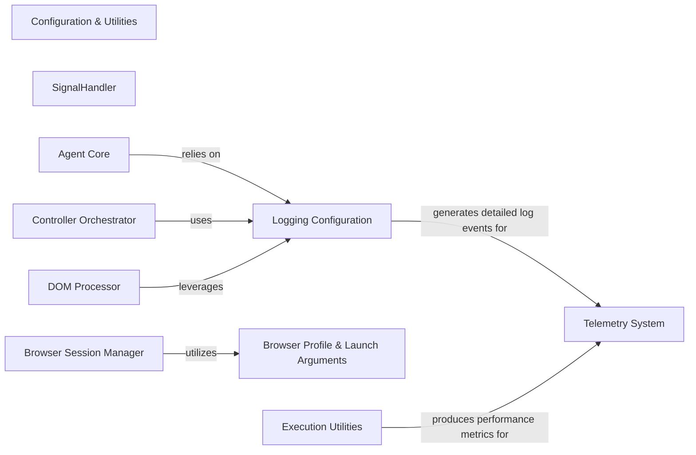

## Component Details

The `Configuration & Utilities` component is fundamental to the project's stability, observability, and configurability. It centralizes cross-cutting concerns that are essential for the reliable operation of all other components. These components are fundamental because they address core non-functional requirements: Observability, Reliability & Stability, Configurability & Consistency, Code Reusability.

### Configuration & Utilities
This foundational component provides a collection of common utility functions, including logging setup, signal handling, and time execution tracking. Crucially, it also defines and manages the data structures and logic for application-wide configuration, particularly browser profiles and launch arguments, ensuring consistent behavior across the application.

**Related Classes/Methods**: _None_

### SignalHandler
Manages operating system signals (e.g., SIGINT, SIGTERM) to enable graceful application pausing, resuming, and exiting. It ensures a controlled shutdown process, preventing abrupt terminations and allowing for necessary cleanup.

**Related Classes/Methods**:

- `SignalHandler` (0:0)

### Logging Configuration
Handles the entire logging setup for the application. This includes defining custom log levels (e.g., 'RESULT'), configuring stream handlers (e.g., console output), setting log verbosity based on environment variables, and silencing verbose third-party loggers.

**Related Classes/Methods**:

- `addLoggingLevel` (0:0)
- `setup_logging` (0:0)

### Browser Profile & Launch Arguments
Defines the data structures and constants for configuring browser instances. This includes various command-line arguments (e.g., for headless mode, security settings, deterministic rendering) and lists of components to disable, ensuring a consistent and controlled browser environment for automation.

**Related Classes/Methods**:

- `CHROME_HEADLESS_ARGS` (0:0)
- `CHROME_DETERMINISTIC_RENDERING_ARGS` (0:0)
- `BrowserProfile` (0:0)

### Execution Utilities
Provides general-purpose utility functions that support various parts of the application, such as performance measurement and URL pattern matching.

**Related Classes/Methods**:

- `time_execution` (0:0)
- `is_url_pattern_match` (0:0)

### Telemetry System
Receives and processes log events and performance metrics for monitoring and analysis.

**Related Classes/Methods**: _None_

### Browser Session Manager
Initializes, configures, and manages browser instances.

**Related Classes/Methods**: _None_

### Agent Core
Handles core agent logic, outputting operational logs and decision-making processes.

**Related Classes/Methods**: _None_

### Controller Orchestrator
Manages and logs the flow of commands, dispatches, and responses within the system.

**Related Classes/Methods**: _None_

### DOM Processor
Processes the Document Object Model (DOM), recording parsing activities and identifying elements.

**Related Classes/Methods**: _None_

### [FAQ](https://github.com/CodeBoarding/GeneratedOnBoardings/tree/main?tab=readme-ov-file#faq)