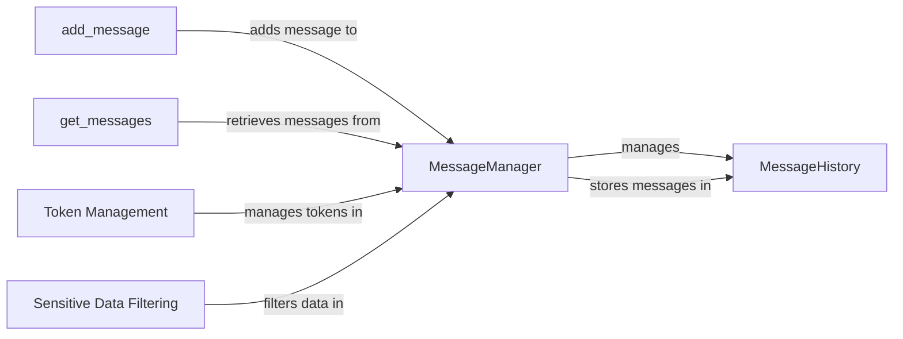

## Component Details

The Context Management component is responsible for maintaining the history of interactions between the user and the agent. It encompasses the storage, retrieval, and manipulation of messages, including filtering sensitive information and managing token counts to prevent overflow. The core functionality revolves around the MessageManager, which orchestrates the addition, storage, and retrieval of messages from the MessageHistory. This ensures a coherent and secure conversation flow, providing a reliable view of the interaction for the user interface.

### MessageManager
The MessageManager is the central component for managing the message history. It handles adding new messages of various types (task, state, model output, plan, tool), counting tokens, cutting messages to prevent overflow, and filtering sensitive data. It interacts with the MessageHistory to persist and retrieve messages.
- **Related Classes/Methods**: `browser_use.agent.message_manager.service.MessageManager`

### MessageHistory
The MessageHistory component is a data structure responsible for storing the message history. It provides methods for adding messages and model outputs. The MessageManager uses it to store and retrieve messages, effectively acting as the persistent storage for the conversation history.
- **Related Classes/Methods**: `browser_use.agent.message_manager.views.MessageHistory`

### add_message
This component represents the functionality of adding a new message to the message history. It is an abstract component that is implemented by different methods in the MessageManager, such as add_new_task, add_state_message, add_model_output, add_plan, and add_tool_message.
- **Related Classes/Methods**: `browser_use.agent.message_manager.service.MessageManager:add_new_task`, `browser_use.agent.message_manager.service.MessageManager:add_state_message`, `browser_use.agent.message_manager.service.MessageManager:add_model_output`, `browser_use.agent.message_manager.service.MessageManager:add_plan`, `browser_use.agent.message_manager.service.MessageManager:add_tool_message`

### get_messages
This component represents the functionality of retrieving messages from the MessageHistory. It allows other components to access the stored conversation history.
- **Related Classes/Methods**: `browser_use.agent.message_manager.service.MessageManager:get_messages`

### Token Management
This component is responsible for managing the token count of the messages. It includes counting tokens, cutting messages to prevent overflow, and adding messages with token handling.
- **Related Classes/Methods**: `browser_use.agent.message_manager.service.MessageManager:_count_tokens`, `browser_use.agent.message_manager.service.MessageManager:cut_messages`, `browser_use.agent.message_manager.service.MessageManager:_add_message_with_tokens`

### Sensitive Data Filtering
This component is responsible for filtering sensitive data from the messages before they are stored in the MessageHistory. It ensures that sensitive information is not persisted in the conversation history.
- **Related Classes/Methods**: `browser_use.agent.message_manager.service.MessageManager:_filter_sensitive_data`
