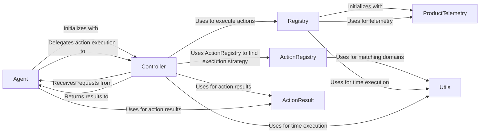

## Component Details

The browser automation subsystem orchestrates interactions with a web browser based on instructions received from an agent. The Agent receives high-level actions, which are then translated into specific browser interactions by the Controller. The Controller uses an ActionRegistry to find the appropriate execution strategy and interacts with the Registry to perform the requested action. The Registry handles sensitive data replacement and leverages ProductTelemetry to track action usage. ActionResult objects are used to pass results between components. Utils provides helper functions for various tasks such as time execution and URL matching.

### Agent
The Agent component serves as the entry point for browser automation requests. It receives instructions, delegates action execution to the Controller, and returns the results. It initializes with a Controller instance.
- **Related Classes/Methods**: `browser_use.agent.service.Agent`

### Controller
The Controller component orchestrates the execution of actions. It receives requests from the Agent, determines the appropriate action to perform, and uses the Registry to execute the action. It also handles tasks like drag and drop, and cell selection.
- **Related Classes/Methods**: `browser_use.controller.service.Controller`

### ActionRegistry
The ActionRegistry component manages the registration and retrieval of available actions. It matches actions to specific domains and provides descriptions for prompting users. It normalizes action function signatures and replaces sensitive data before execution.
- **Related Classes/Methods**: `browser_use.controller.registry.views.ActionRegistry`

### Registry
The Registry component stores and executes actions. It normalizes action function signatures, replaces sensitive data, and integrates with telemetry to track action usage. It also creates action models for telemetry purposes.
- **Related Classes/Methods**: `browser_use.controller.registry.service.Registry`

### ProductTelemetry
The ProductTelemetry component captures and records telemetry data related to action usage and performance. It is used by the Registry to track registered functions and other relevant events.
- **Related Classes/Methods**: `browser_use.telemetry.service.ProductTelemetry`

### ActionResult
The ActionResult component represents the result of an action execution. It is used by the Controller and Agent to pass results between components.
- **Related Classes/Methods**: `browser_use.agent.views.ActionResult`

### Utils
The Utils module contains utility functions for time execution, matching URLs with domain patterns, and other helper functions used throughout the subsystem.
- **Related Classes/Methods**: `browser_use.utils.time_execution_sync`, `browser_use.utils.time_execution_async`, `browser_use.utils.match_url_with_domain_pattern`