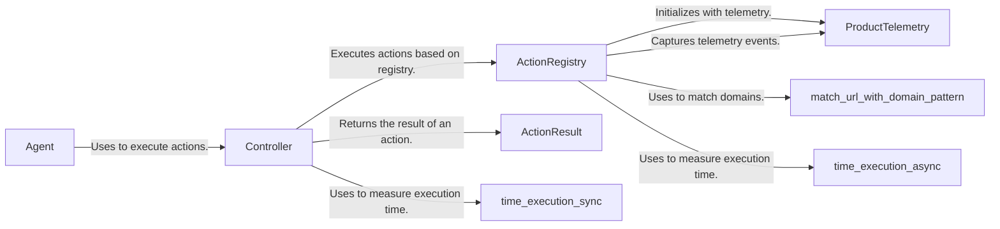

## Component Details

The Controller Service orchestrates the interaction between the Agent and the browser. It receives actions from the Agent, uses the ActionRegistry to determine the appropriate action to execute, and then executes that action in the browser. The Controller Service manages browser state, handles results, and collects telemetry data. It leverages utility functions for timing and URL matching.

### Controller
The Controller class is responsible for executing actions in the browser. It receives instructions from the Agent, interacts with the ActionRegistry to find the appropriate action, and then executes that action. It also handles browser state management and result processing.
- **Related Classes/Methods**: `browser_use.controller.service.Controller`

### ActionRegistry
The ActionRegistry class manages the available actions that can be performed in the browser. It stores a collection of actions, matches actions to specific domains or page filters, and provides descriptions of actions for prompt generation. It also handles the execution of actions, including replacing sensitive data and logging usage.
- **Related Classes/Methods**: `browser_use.controller.registry.views.ActionRegistry`, `browser_use.controller.registry.service.Registry`

### Agent
The Agent class is the entry point for interacting with the browser. It receives instructions and uses the Controller to execute actions in the browser. It orchestrates the overall process of interacting with the browser based on external input.
- **Related Classes/Methods**: `browser_use.agent.service.Agent`

### ActionResult
The ActionResult class represents the result of an action performed in the browser. It contains information about the success or failure of the action, as well as any relevant data or messages.
- **Related Classes/Methods**: `browser_use.agent.views.ActionResult`

### ProductTelemetry
The ProductTelemetry class is responsible for collecting and reporting telemetry data about the usage of the `browser-use` subsystem. It captures events related to registered actions and controller functions.
- **Related Classes/Methods**: `browser_use.telemetry.service.ProductTelemetry`, `browser_use.telemetry.views.ControllerRegisteredFunctionsTelemetryEvent`, `browser_use.telemetry.views.RegisteredFunction`

### time_execution_sync
A utility function that measures the execution time of a synchronous function.
- **Related Classes/Methods**: `browser_use.utils.time_execution_sync`

### time_execution_async
A utility function that measures the execution time of an asynchronous function.
- **Related Classes/Methods**: `browser_use.utils.time_execution_async`

### match_url_with_domain_pattern
A utility function that matches a URL against a domain pattern.
- **Related Classes/Methods**: `browser_use.utils.match_url_with_domain_pattern`