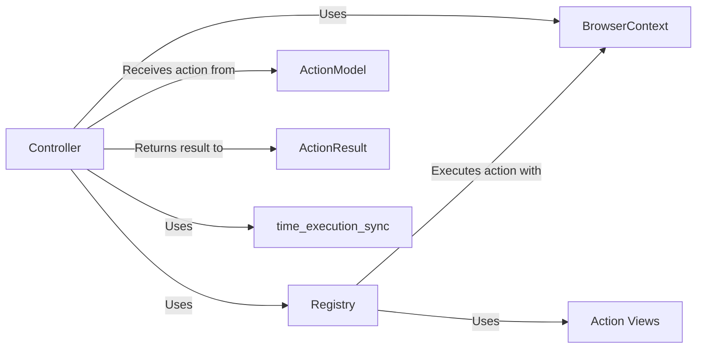

## Component Details

### Controller
The Controller receives actions from the agent, delegates their execution to the Registry, and returns the results. It initializes the Registry with default browser actions and measures the execution time of the 'act' method.
- **Related Classes/Methods**: `browser_use.controller.service.Controller`, `browser_use.controller.service.Controller:__init__`, `browser_use.controller.service.Controller:act`

### Registry
The Registry maintains a list of available actions and their descriptions. It matches actions based on domain and page filters, creates parameter models, and executes actions using the BrowserContext. It also handles sensitive data replacement.
- **Related Classes/Methods**: `browser_use.controller.registry.service.Registry`, `browser_use.controller.registry.service.Registry:action`, `browser_use.controller.registry.service.Registry:execute_action`, `browser_use.controller.registry.service.Registry:_replace_sensitive_data`

### BrowserContext
The BrowserContext provides an interface for interacting with the browser, managing browser sessions, pages, and elements. It encapsulates the Playwright library and offers higher-level functions for browser interaction.
- **Related Classes/Methods**: `browser_use.browser.context.BrowserContext`

### ActionModel
The ActionModel represents the action to be performed, including the action name and parameters. It serves as the input to the Controller's 'act' method.
- **Related Classes/Methods**: `browser_use.agent.views.ActionModel`

### ActionResult
The ActionResult represents the outcome of an action performed in the browser, including extracted content, success status, and error messages. It is returned by the Controller's 'act' method.
- **Related Classes/Methods**: `browser_use.agent.views.ActionResult`

### Action Views
Action Views are data models that define the parameters for different actions, such as clicking elements, navigating to URLs, and inputting text. They specify the expected input for each action.
- **Related Classes/Methods**: `browser_use.controller.views.ClickElementAction`, `browser_use.controller.views.CloseTabAction`, `browser_use.controller.views.DoneAction`, `browser_use.controller.views.DragDropAction`, `browser_use.controller.views.GoToUrlAction`, `browser_use.controller.views.InputTextAction`, `browser_use.controller.views.NoParamsAction`, `browser_use.controller.views.OpenTabAction`, `browser_use.controller.views.Position`, `browser_use.controller.views.ScrollAction`, `browser_use.controller.views.SearchGoogleAction`, `browser_use.controller.views.SendKeysAction`, `browser_use.controller.views.SwitchTabAction`

### time_execution_sync
A utility function used to measure the execution time of the 'act' method in the Controller.
- **Related Classes/Methods**: `browser_use.utils.time_execution_sync`
