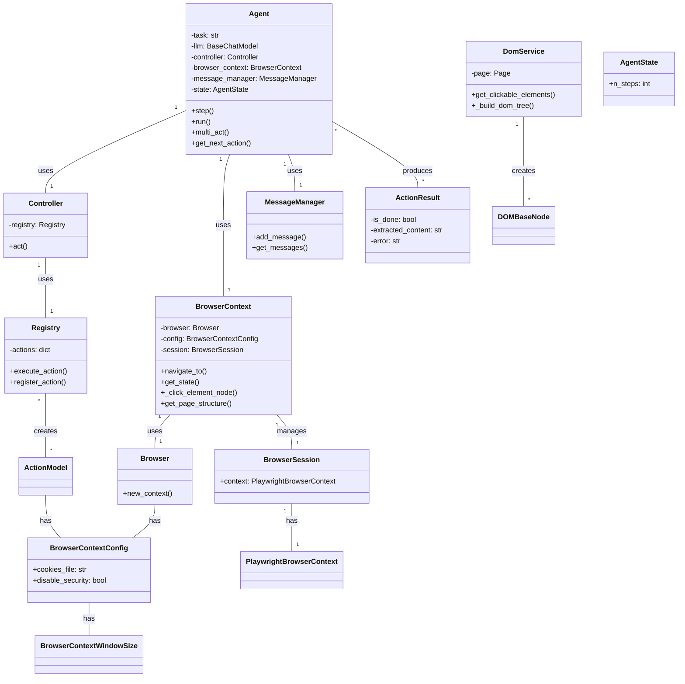

Based on the code analysis, here's a refined overview of the component:

**Component Description:**

The `Browser Use` component provides a framework for automating web browser interactions. It allows an agent, typically driven by a Large Language Model (LLM), to perform tasks within a web browser, such as navigating to URLs, interacting with DOM elements, extracting information, and managing browser state. The core classes are `Agent`, `BrowserContext`, `Controller`, and `DomService`. The `Agent` orchestrates the process, using the `BrowserContext` to manage the browser and the `Controller` to execute actions. The `DomService` is responsible for extracting and representing the DOM of a web page.

**Main Classes and Their Purposes:**

*   **Agent:** The central orchestrator. It plans and executes tasks, manages agent state, interacts with the LLM, and uses the `Controller` to perform actions in the browser.
*   **BrowserContext:** Manages a single browser session. It handles navigation, DOM interaction, state management (URL, title, screenshot), and tab management.
*   **Controller:** Executes actions on the browser based on instructions from the `Agent`. It uses an `ActionRegistry` to find and execute the appropriate action.
*   **DomService:** Extracts, processes, and represents the Document Object Model (DOM) of a web page. It builds a tree structure of the DOM and identifies interactive elements.
*   **ActionRegistry:** Holds the available actions that the agent can perform.

**Visualization:**

A class diagram best represents the structure of this component, highlighting the relationships between the core classes.

