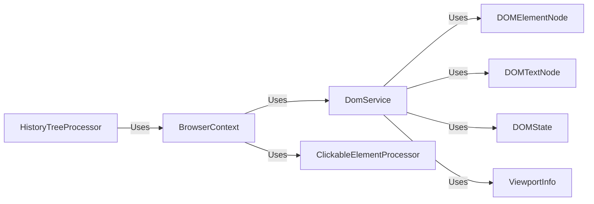

## Component Details

The DOM Parsing subsystem is responsible for extracting information from web pages by parsing the HTML content and constructing a DOM tree. The core functionality revolves around the DomService, which utilizes other components like DOMElementNode and DOMTextNode to represent the DOM structure. The BrowserContext orchestrates the process by retrieving the HTML and calling the DomService to parse it. Clickable elements are identified and processed to enable interaction with the web page. The HistoryTreeProcessor tracks changes in the DOM over time, while utility functions like time_execution_sync help measure performance.

### BrowserContext
Manages the browser context, including retrieving the DOM state, handling cookies, taking screenshots, and managing tabs. It orchestrates the interaction between the browser and the DOM services.
- **Related Classes/Methods**: `browser-use/browser_use/browser/context.py`

### DomService
Provides services for interacting with the DOM, including building the DOM tree, parsing nodes, and identifying clickable elements. It acts as an intermediary between the BrowserContext and the DOM representation.
- **Related Classes/Methods**: `browser-use/browser_use/dom/service.py`

### DOMElementNode
Represents a DOM element node and provides methods for extracting text and identifying clickable elements within the node's subtree.
- **Related Classes/Methods**: `browser-use/browser_use/dom/views.py`

### DOMTextNode
Represents a text node within the DOM tree.
- **Related Classes/Methods**: `browser-use/browser_use/dom/views.py`

### DOMState
Represents the state of the DOM at a given point in time.
- **Related Classes/Methods**: `browser_use.dom.views.DOMState`

### HistoryTreeProcessor
Processes the DOM to create a history tree, enabling tracking of changes and comparisons between different DOM states. It involves hashing DOM elements and their attributes for efficient comparison.
- **Related Classes/Methods**: `browser-use/browser_use/dom/history_tree_processor/service.py`, `browser-use/browser_use/dom/history_tree_processor/view.py`

### ClickableElementProcessor
Identifies and processes clickable elements within the DOM, generating hashes for these elements to facilitate tracking and comparison.
- **Related Classes/Methods**: `browser-use/browser_use/dom/clickable_element_processor/service.py`

### ViewportInfo
Provides information about the viewport of the browser window.
- **Related Classes/Methods**: `browser_use.dom.service.ViewportInfo`
