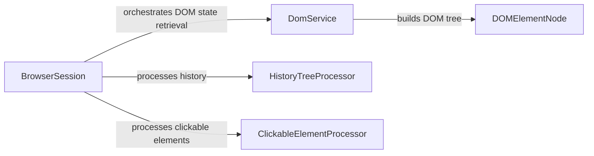

## Component Details

The DOM Processing & Abstraction component is responsible for extracting, processing, and representing the Document Object Model (DOM) of web pages. It provides a structured representation of the web page's content and identifies potential actions, enabling the agent to understand the page's structure and interact with it effectively. The main flow involves retrieving the raw HTML, parsing it into a DOM tree, identifying clickable elements, and maintaining a history of DOM states to track changes.

### BrowserSession
Manages the browser session, including navigation, state retrieval, and cookie management. It orchestrates the process of getting the current page state, including the DOM, clickable elements, and other relevant information.
- **Related Classes/Methods**: `browser-use.browser_use.browser.session.BrowserSession`

### DomService
Responsible for building and parsing the DOM tree. It takes the raw HTML and constructs a structured representation of the DOM, identifying different types of nodes and their attributes.
- **Related Classes/Methods**: `browser-use.browser_use.dom.service.DomService`

### DOMElementNode
Represents a DOM element node in the DOM tree. It provides methods for extracting text content and identifying clickable elements within the node.
- **Related Classes/Methods**: `browser-use.browser_use.dom.views.DOMElementNode`

### HistoryTreeProcessor
Processes and compares DOM elements to maintain a history tree of DOM states. It converts DOM elements into history elements, finds them in the tree, and compares them to identify changes.
- **Related Classes/Methods**: `browser_use.dom.history_tree_processor.service.HistoryTreeProcessor`

### ClickableElementProcessor
Identifies and processes clickable elements within the DOM. It extracts clickable elements and generates hashes for them, which are used for tracking and comparison.
- **Related Classes/Methods**: `browser_use.dom.clickable_element_processor.service.ClickableElementProcessor`