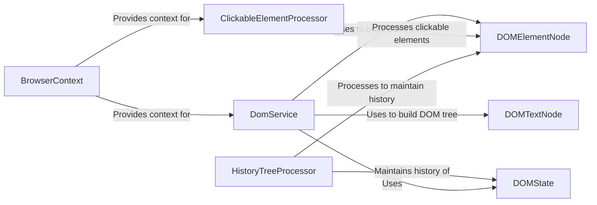

## Component Details

### DomService
The DomService is the central component for building and parsing the DOM tree. It fetches the DOM from the BrowserContext, converts it into a tree structure of DOMElementNode and DOMTextNode objects, and extracts clickable elements using the ClickableElementProcessor. It also handles cross-origin iframes and measures the execution time of critical operations.
- **Related Classes/Methods**: `browser_use.dom.service.DomService`

### DOMElementNode
Represents a DOM element node in the DOM tree. It provides methods to extract text content and identify clickable elements within the node's subtree. It serves as a building block for representing the structure of the DOM.
- **Related Classes/Methods**: `browser_use.dom.views.DOMElementNode`

### DOMTextNode
Represents a DOM text node, containing the text content of a DOM element. It is a leaf node in the DOM tree and provides access to the text content of the web page.
- **Related Classes/Methods**: `browser_use.dom.views.DOMTextNode`

### ClickableElementProcessor
The ClickableElementProcessor is responsible for identifying and processing clickable elements within the DOM. It hashes the elements for efficient retrieval and management, enabling the agent to interact with specific elements on the web page.
- **Related Classes/Methods**: `browser_use.dom.clickable_element_processor.service.ClickableElementProcessor`

### HistoryTreeProcessor
The HistoryTreeProcessor manages the history of DOM elements by converting them to history elements, finding them in the tree, and comparing them to detect changes. It helps in tracking DOM changes over time, allowing the agent to understand the evolution of the web page.
- **Related Classes/Methods**: `browser_use.dom.history_tree_processor.service.HistoryTreeProcessor`

### BrowserContext
The BrowserContext provides the context for the browser, including methods to get the state of the DOM and update it. It acts as an interface to the browser's state, providing access to the DOM and other browser-related information.
- **Related Classes/Methods**: `browser_use.browser.context.BrowserContext`

### DOMState
Represents the state of the DOM, capturing the structure and content of the DOM at a specific point in time. It is used by the HistoryTreeProcessor to track changes in the DOM over time.
- **Related Classes/Methods**: `browser_use.dom.views.DOMState`
