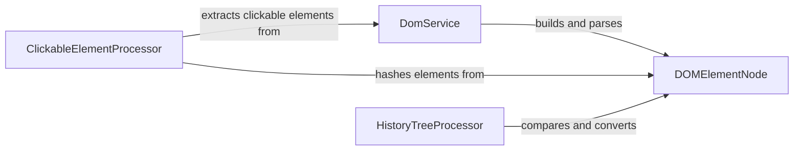

## Component Details

The DOM Processing component is responsible for extracting, analyzing, and manipulating the Document Object Model (DOM) of web pages. It builds a DOM tree, identifies clickable elements, and extracts text content. The process starts with fetching the DOM from the browser, parsing it into a tree structure represented by DOMElementNode, identifying clickable elements using ClickableElementProcessor, and tracking changes using HistoryTreeProcessor. The DomService acts as the central component, orchestrating the DOM tree construction and interaction with other processors.

### DomService
The DomService is the central component responsible for building and parsing the DOM tree. It fetches the DOM from the browser, converts it into a tree structure of DOMElementNode objects, and identifies cross-origin iframes. It orchestrates the interaction between the DOM tree and other processors like ClickableElementProcessor and HistoryTreeProcessor.
- **Related Classes/Methods**: `browser_use.browser_use.dom.service.DomService`

### DOMElementNode
The DOMElementNode represents a single node in the DOM tree. It stores information about the element's attributes, text content, and children. It provides methods for accessing and manipulating this information, and it's used by DomService to construct the DOM tree and by other components to extract information from the tree.
- **Related Classes/Methods**: `browser_use.browser_use.dom.views.DOMElementNode`

### ClickableElementProcessor
The ClickableElementProcessor identifies and hashes clickable elements within the DOM tree. It uses various hashing techniques (xpath, text, attributes) to create unique identifiers for these elements. These identifiers are used to track and interact with clickable elements on the page.
- **Related Classes/Methods**: `browser_use.dom.clickable_element_processor.service.ClickableElementProcessor`

### HistoryTreeProcessor
The HistoryTreeProcessor compares DOM elements with history elements to track changes on a webpage. It converts DOM elements to history elements, finds elements in the history tree, and compares them based on their hashes. This allows the system to identify changes in the DOM over time.
- **Related Classes/Methods**: `browser_use.dom.history_tree_processor.service.HistoryTreeProcessor`