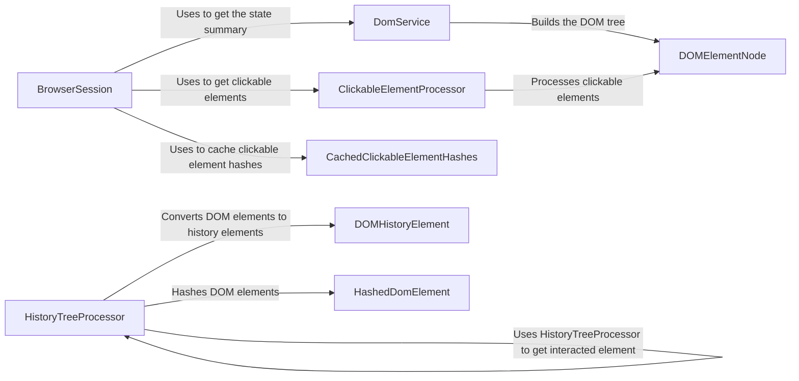

## Component Details

The DOM Processor subsystem is responsible for extracting, processing, and managing the Document Object Model (DOM) of web pages within a browser automation context. It encompasses building the DOM tree, identifying clickable elements, managing DOM state history, and providing efficient mechanisms for querying and comparing DOM elements. The core functionality revolves around transforming raw HTML into a structured DOM representation, extracting interactive elements, and tracking changes to the DOM over time to facilitate intelligent interaction and analysis.

### BrowserSession
The BrowserSession component manages the lifecycle of a browser instance, providing methods for navigating web pages, executing JavaScript, and retrieving the current DOM state. It acts as the entry point for interacting with the browser and orchestrates the retrieval of DOM information, clickable elements, and other browser-related data.
- **Related Classes/Methods**: `browser-use.browser_use.browser.session.BrowserSession`

### DomService
The DomService component is responsible for parsing HTML content and constructing a hierarchical DOM tree representation. It identifies different types of DOM nodes (elements, text) and extracts information about cross-origin iframes. The resulting DOM tree serves as the foundation for subsequent analysis and manipulation of the web page structure.
- **Related Classes/Methods**: `browser-use.browser_use.dom.service.DomService`

### DOMElementNode
The DOMElementNode component represents a single element node within the DOM tree. It provides methods for extracting text content, identifying clickable elements within the node, and generating unique identifiers for the element. It encapsulates the data and behavior associated with individual DOM elements.
- **Related Classes/Methods**: `browser-use.browser_use.dom.views.DOMElementNode`

### ClickableElementProcessor
The ClickableElementProcessor component identifies and extracts clickable elements from the DOM tree. It generates hashes for these elements to enable efficient caching and retrieval. This component focuses on identifying interactive elements within the DOM that can be targeted for user actions.
- **Related Classes/Methods**: `browser_use.dom.clickable_element_processor.service.ClickableElementProcessor`, `browser-use/browser_use/dom/clickable_element_processor/service.py`

### CachedClickableElementHashes
The CachedClickableElementHashes component provides a caching mechanism for the hashes of clickable elements. This caching improves performance by avoiding redundant hash computations when the DOM is updated. It stores and retrieves clickable element hashes for efficient access.
- **Related Classes/Methods**: `browser-use.browser_use.browser.session.CachedClickableElementHashes`

### HistoryTreeProcessor
The HistoryTreeProcessor component manages the history of DOM states. It converts DOM elements to history elements, finds elements in the history tree, and compares DOM elements with their historical counterparts to identify changes. This component enables tracking and analysis of DOM modifications over time.
- **Related Classes/Methods**: `browser_use.dom.history_tree_processor.service.HistoryTreeProcessor`, `browser-use/browser_use/dom/history_tree_processor/service.py`

### DOMHistoryElement
The DOMHistoryElement component represents a DOM element within the history tree. It stores information about the element's state at a specific point in time, allowing for comparison and analysis of DOM changes over time. It encapsulates the historical state of a DOM element.
- **Related Classes/Methods**: `browser_use.dom.history_tree_processor.view.DOMHistoryElement`

### HashedDomElement
The HashedDomElement component represents a hashed DOM element, used for efficient comparison and storage of DOM elements in the history tree. Hashing allows for quick identification of changes and efficient storage of DOM element states.
- **Related Classes/Methods**: `browser_use.dom.history_tree_processor.view.HashedDomElement`