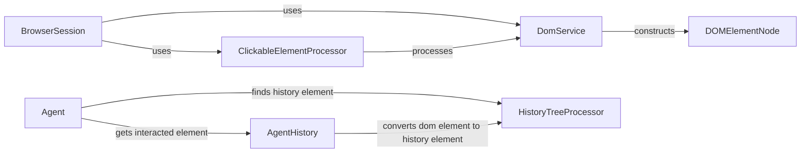

## Component Details

The DOM Processor component is responsible for extracting, processing, and analyzing the Document Object Model (DOM) of web pages. It builds a DOM tree, identifies clickable elements, and provides structured information about the page structure to the Agent Service, enabling intelligent decision-making during automation tasks. The main flow involves the DomService building the DOM tree, the ClickableElementProcessor identifying clickable elements, and the HistoryTreeProcessor managing the history of DOM states. The purpose is to provide a structured representation of the web page's DOM to the agent for intelligent interaction.

### BrowserSession
Manages the browser session and retrieves the state summary, including clickable elements and their hashes. It caches clickable element hashes for performance. It interacts with DomService to get the updated DOM state and ClickableElementProcessor to identify and hash clickable elements.
- **Related Classes/Methods**: `browser_use.browser_use.browser.session.BrowserSession`

### DomService
Responsible for building and parsing the DOM tree from the browser. It extracts clickable elements and cross-origin iframes. It interacts with DOMElementNode, DOMTextNode, and ViewportInfo to construct the DOM tree and uses helper functions to parse individual nodes.
- **Related Classes/Methods**: `browser_use.dom.service.DomService`

### DOMElementNode
Represents a DOM element node in the DOM tree. It provides methods to extract text and identify clickable elements within the node. It interacts with other DOMElementNode instances to traverse the DOM tree and collect text content.
- **Related Classes/Methods**: `browser_use.dom.views.DOMElementNode`

### ClickableElementProcessor
Processes the DOM to identify and hash clickable elements. It calculates hashes based on various attributes of the DOM element, including its XPath, attributes, and text. It interacts with DomService to get the DOM and BrowserSession to provide clickable element hashes.
- **Related Classes/Methods**: `browser_use.dom.clickable_element_processor.service.ClickableElementProcessor`

### HistoryTreeProcessor
Manages the historical record of DOM states. It converts DOM elements to history elements, finds history elements in the tree, and compares history elements with DOM elements. It interacts with DOMHistoryElement and HashedDomElement to represent and hash DOM elements in the history tree.
- **Related Classes/Methods**: `browser_use.dom.history_tree_processor.service.HistoryTreeProcessor`

### Agent
Represents an agent that interacts with the browser. It makes history items and updates action indices based on the interacted element. It interacts with AgentHistory to get the interacted element and HistoryTreeProcessor to find history elements.
- **Related Classes/Methods**: `browser_use.agent.service.Agent`

### AgentHistory
Manages the history of agent interactions. It provides methods to get the interacted element from the history. It interacts with HistoryTreeProcessor to convert DOM elements to history elements.
- **Related Classes/Methods**: `browser_use.agent.views.AgentHistory`