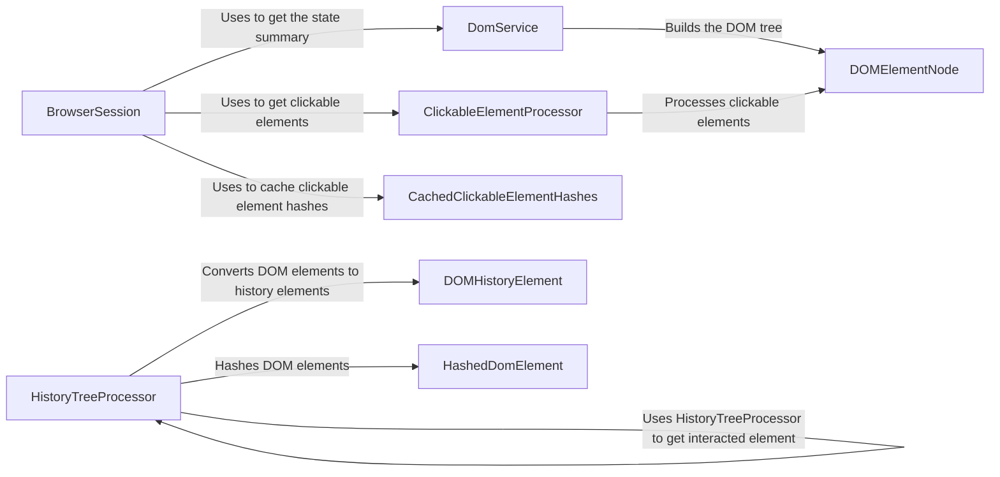

## Component Details

The DOM Understanding component is responsible for extracting, processing, and understanding the structure and content of web pages represented as Document Object Models (DOMs). It involves building DOM trees, identifying clickable elements, and extracting text content, enabling the agent to interact with and understand web pages effectively. The core flow involves retrieving HTML content, parsing it into a DOM tree, identifying interactive elements, and caching relevant information for future use.

### BrowserSession
Manages the browser session, providing functionalities to retrieve the current page's HTML, execute JavaScript, and manage cookies. It acts as the entry point for obtaining the DOM and related information.
- **Related Classes/Methods**: `browser_use.browser_use.browser.session.BrowserSession`

### DomService
Builds the DOM tree from the HTML content retrieved by the BrowserSession. It parses the HTML, creates a hierarchical representation of the DOM, and extracts information about cross-origin iframes.
- **Related Classes/Methods**: `browser_use.dom.service.DomService`

### DOMElementNode
Represents a single element node within the DOM tree. It provides methods for extracting text content, identifying clickable elements, and generating unique identifiers for the element.
- **Related Classes/Methods**: `browser_use.dom.views.DOMElementNode`

### ClickableElementProcessor
Identifies and processes clickable elements within the DOM tree. It extracts these elements, generates hashes for them, and caches the hashes for efficient retrieval.
- **Related Classes/Methods**: `browser_use.dom.clickable_element_processor.service.ClickableElementProcessor`

### CachedClickableElementHashes
Caches the hashes of clickable elements to improve performance. This avoids recomputing the hashes every time the DOM is updated, providing a faster way to check if an element has been interacted with before.
- **Related Classes/Methods**: `browser_use.browser_use.browser.session.CachedClickableElementHashes`

### HistoryTreeProcessor
Manages the history of DOM states, converting DOM elements to history elements, finding elements in the history tree, and comparing DOM elements with their historical counterparts to identify changes.
- **Related Classes/Methods**: `browser_use.dom.history_tree_processor.service.HistoryTreeProcessor`, `browser_use/browser_use/dom/history_tree_processor/service.py`

### DOMHistoryElement
Represents a DOM element in the history tree, storing information about the element's state at a particular point in time.
- **Related Classes/Methods**: `browser_use.dom.history_tree_processor.view.DOMHistoryElement`

### HashedDomElement
Represents a hashed DOM element, used for efficient comparison and storage of DOM elements in the history tree.
- **Related Classes/Methods**: `browser_use.dom.history_tree_processor.view.HashedDomElement`