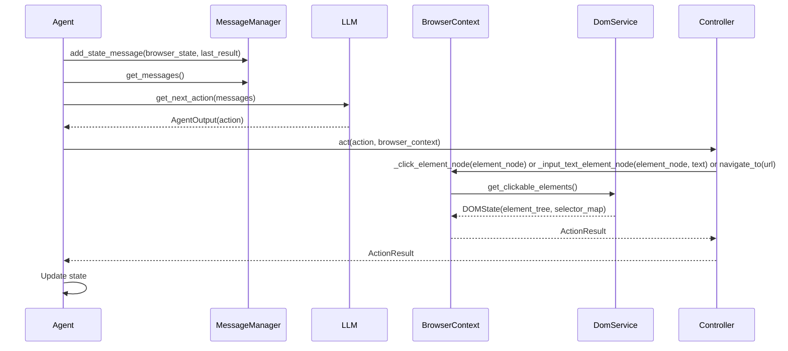
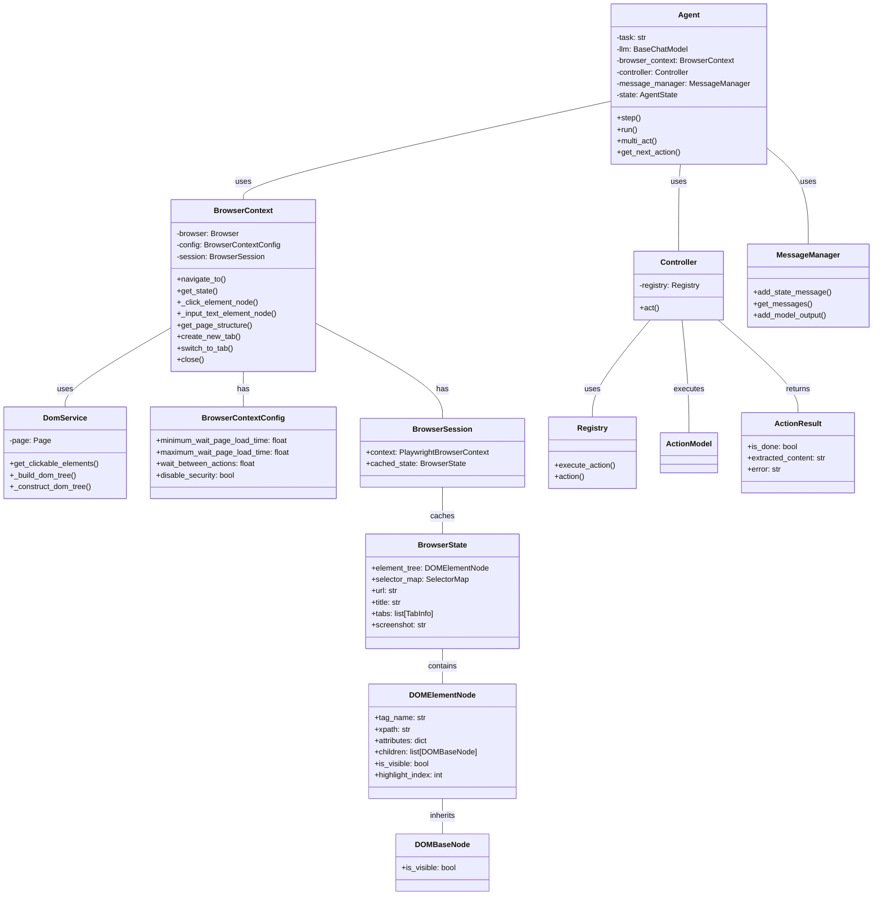

Based on the code analysis, here's a refined overview of the `browser-use` component, focusing on the core modules and their interactions:

**Component Description:**

The `browser-use` component provides an interface for programmatically controlling a web browser. It allows an agent to interact with web pages, extract information, and automate tasks. The core of the component revolves around the `Agent`, which uses a `BrowserContext` to interact with the DOM of a web page, mediated by the `DomService`. The `Controller` provides a registry of available actions that the agent can take.

**Main Classes and Their Purposes:**

1.  **`Agent`**: Orchestrates the browsing task. It plans steps, executes actions via the `Controller`, and manages the agent's state and memory. It uses an LLM to determine the next action.
2.  **`BrowserContext`**: Manages a browser session, including navigation, page state, and interaction with web elements. It uses Playwright for browser control.
3.  **`DomService`**: Responsible for extracting, processing, and representing the Document Object Model (DOM) of a web page. It builds a tree structure of the DOM and identifies clickable elements.
4.  **`Controller`**: A central registry of actions that the agent can perform. It provides a unified interface for executing actions on the `BrowserContext`.
5.  **`MessageManager`**: Manages the messages exchanged between the agent and the LLM, including system prompts, user inputs, and model outputs.

**Main Flow (Sequence Diagram):**

**Component Structure (Class Diagram):**

