```mermaid
graph LR
    Browser_Automation_Core["Browser Automation Core"]
    LLM_Integration_Layer["LLM Integration Layer"]
    MCP_Protocol_Adapter["MCP Protocol Adapter"]
    Async_Task_Manager["Async Task Manager"]
    Synchronization_Service["Synchronization Service"]
    Document_Processing_Service["Document Processing Service"]
    Telemetry_Service["Telemetry Service"]
    Browser_Automation_Core -- "uses" --> LLM_Integration_Layer
    LLM_Integration_Layer -- "translates" --> MCP_Protocol_Adapter
    MCP_Protocol_Adapter -- "coordinates" --> Async_Task_Manager
    Async_Task_Manager -- "authenticates" --> Synchronization_Service
    Synchronization_Service -- "processes" --> Document_Processing_Service
    Document_Processing_Service -- "reports" --> Telemetry_Service
    Synchronization_Service -- "sends metrics" --> Telemetry_Service
    click Browser_Automation_Core href "https://github.com/CodeBoarding/GeneratedOnBoardings/blob/main/browser-use/Browser_Automation_Core.md" "Details"
    click LLM_Integration_Layer href "https://github.com/CodeBoarding/GeneratedOnBoardings/blob/main/browser-use/LLM_Integration_Layer.md" "Details"
    click MCP_Protocol_Adapter href "https://github.com/CodeBoarding/GeneratedOnBoardings/blob/main/browser-use/MCP_Protocol_Adapter.md" "Details"
```

## Details

The architecture follows a layered pattern with browser automation core at its foundation, supported by LLM integration and protocol adaptation layers. Infrastructure services provide cross-cutting concerns like synchronization, document processing, and telemetry. Async task manager coordinates operations between components, ensuring efficient resource utilization. This structure enables extensibility through protocol interoperability while maintaining clear separation of concerns.

### Browser Automation Core [[Expand]](./Browser_Automation_Core.md)
Central engine managing browser control, DOM manipulation, and low-level browser interactions

**Related Classes/Methods**:

- `browser_use.core.browser.Browser` (15:45)
- `browser_use.core.dom.DOMElement` (80:120)

### LLM Integration Layer [[Expand]](./LLM_Integration_Layer.md)
Abstracts LLM provider interactions, prompt engineering, and response parsing

**Related Classes/Methods**:

- `browser_use.llm.provider.LLMProvider` (30:70)
- `browser_use.llm.prompt.PromptTemplate` (45:85)

### MCP Protocol Adapter [[Expand]](./MCP_Protocol_Adapter.md)
Translates between browser automation commands and Machine Copilot Protocol

**Related Classes/Methods**:

- `browser_use.protocol.mcp.MCPMessage` (20:60)
- `browser_use.protocol.adapter.ProtocolAdapter` (90:130)

### Async Task Manager
Coordinates concurrent browser sessions and event-driven task execution

**Related Classes/Methods**:

- `browser_use.async.task.AsyncTask` (50:90)
- `browser_use.async.scheduler.TaskScheduler` (110:150)

### Synchronization Service
Secure authentication and data synchronization between browser instances

**Related Classes/Methods**:

- <a href="https://github.com/browser-use/browser-use/blob/main/browser_use/sync/auth.py#L25-L65" target="_blank" rel="noopener noreferrer">`browser_use.sync.auth.CloudAuthenticator` (25:65)</a>
- <a href="https://github.com/browser-use/browser-use/blob/main/browser_use/sync/service.py#L70-L110" target="_blank" rel="noopener noreferrer">`browser_use.sync.service.SynchronizationService` (70:110)</a>

### Document Processing Service
PDF handling, file conversion, and document-specific operations

**Related Classes/Methods**:

- <a href="https://github.com/browser-use/browser-use/blob/main/browser_use/filesystem/file_system.py#L40-L80" target="_blank" rel="noopener noreferrer">`browser_use.filesystem.file_system.PdfFileHandler` (40:80)</a>

### Telemetry Service
Centralized observability metrics collection and aggregation

**Related Classes/Methods**:

- <a href="https://github.com/browser-use/browser-use/blob/main/browser_use/observability.py#L60-L100" target="_blank" rel="noopener noreferrer">`browser_use.observability.telemetry.TelemetryCollector` (60:100)</a>

### [FAQ](https://github.com/CodeBoarding/GeneratedOnBoardings/tree/main?tab=readme-ov-file#faq)