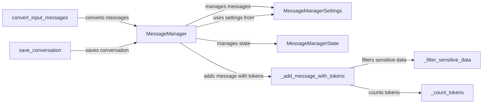

## Component Details

The LLM Communication component facilitates the exchange of messages between the agent and the LLM. It encompasses message formatting, token management, and sensitive data filtering to ensure effective and secure communication. The core flow involves adding new tasks or state information, processing the messages by filtering and counting tokens, and then converting the messages into a format suitable for the LLM. The conversation can also be saved for later analysis.

### MessageManager
The MessageManager class is the central component responsible for managing the message flow between the agent and the LLM. It handles adding new tasks, storing state information, enforcing token limits, and filtering sensitive data to ensure effective and secure communication. It orchestrates the addition of messages, token counting, and sensitive data filtering.
- **Related Classes/Methods**: `browser_use.agent.message_manager.service.MessageManager`

### MessageManagerSettings
The MessageManagerSettings class holds the configuration settings for the MessageManager, such as token limits, sensitive data patterns, and tokenizer information. These settings govern the behavior of the message management process.
- **Related Classes/Methods**: `browser_use.agent.message_manager.service.MessageManagerSettings`

### MessageManagerState
The MessageManagerState class represents the state of the message manager, tracking the current message history, token usage, and other relevant information. It provides a snapshot of the conversation's progress and resource consumption.
- **Related Classes/Methods**: `browser_use.agent.message_manager.views.MessageManagerState`

### _add_message_with_tokens
The _add_message_with_tokens method adds a message to the message history while also counting the number of tokens in the message. It interacts with _filter_sensitive_data and _count_tokens to ensure that the message is properly processed before being added to the history.
- **Related Classes/Methods**: `browser_use.agent.message_manager.service.MessageManager._add_message_with_tokens`

### _filter_sensitive_data
The _filter_sensitive_data method filters sensitive data from the message to prevent information leakage. It uses predefined patterns to identify and redact sensitive information, ensuring that confidential data is not exposed to the LLM.
- **Related Classes/Methods**: `browser_use.agent.message_manager.service.MessageManager._filter_sensitive_data`

### _count_tokens
The _count_tokens method counts the number of tokens in the message using a tokenizer. It is used by _add_message_with_tokens to track token usage and ensure that the token limit is not exceeded.
- **Related Classes/Methods**: `browser_use.agent.message_manager.service.MessageManager._count_tokens`

### convert_input_messages
The convert_input_messages function converts input messages into a format suitable for different LLMs. This ensures compatibility and optimal performance with various LLM providers, allowing the agent to seamlessly switch between different LLMs.
- **Related Classes/Methods**: `browser_use.agent.message_manager.utils.convert_input_messages`

### save_conversation
The save_conversation function saves the conversation history to a file for later analysis or review. This provides a record of the agent's interactions with the LLM, which can be useful for debugging, auditing, or training purposes.
- **Related Classes/Methods**: `browser_use.agent.message_manager.utils.save_conversation`
