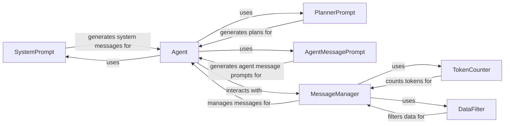

## Component Details

The LLM Interaction component is responsible for managing the communication between the agent and the LLM. It encompasses the generation of prompts, the management of message history, and the filtering of sensitive data. The component ensures that the LLM receives clear and concise instructions, and that the agent's interactions with the LLM are secure and efficient. It uses prompt templates to create system prompts, planner prompts, and agent message prompts. It also manages the message history, including prompts, LLM responses, and tool outputs. Finally, it filters sensitive data from the messages exchanged between the agent and the LLM.

### SystemPrompt
The SystemPrompt component is responsible for generating the initial system prompt that guides the LLM's behavior. It sets the overall context and provides instructions to the LLM, defining how it should respond and what tasks it should prioritize. This component ensures that the LLM understands its role and the expected format of its responses.
- **Related Classes/Methods**: `browser_use.agent.prompts.SystemPrompt`

### PlannerPrompt
The PlannerPrompt component generates the prompt used by the planner to create a plan of action. It provides the LLM with the necessary information to generate a sequence of steps to achieve the task. This includes the current state, the goal, and any relevant constraints. The PlannerPrompt ensures that the LLM has enough context to create a feasible and effective plan.
- **Related Classes/Methods**: `browser_use.agent.prompts.PlannerPrompt`

### AgentMessagePrompt
The AgentMessagePrompt component generates the prompt used to elicit the next action from the agent. It presents the LLM with the current state, including the message history and any relevant tool outputs, and asks for the next action to take. This component ensures that the LLM has all the information it needs to make an informed decision about the next step.
- **Related Classes/Methods**: `browser_use.agent.prompts.AgentMessagePrompt`

### MessageManager
The MessageManager component manages the messages exchanged between the agent and the LLM. It stores, retrieves, and manipulates the message history, including prompts, LLM responses, and tool outputs. It also handles token counting and message truncation to stay within the LLM's context window. The MessageManager ensures that the message history is maintained and that the LLM has access to the relevant information.
- **Related Classes/Methods**: `browser_use.agent.message_manager.service.MessageManager`, `browser_use.agent.message_manager.views.MessageHistory`

### TokenCounter
The TokenCounter component counts the number of tokens in a given text. This is used to ensure that the messages sent to the LLM do not exceed the maximum token limit. The TokenCounter is used by the MessageManager to truncate messages when necessary.
- **Related Classes/Methods**: `browser_use.agent.message_manager.service.MessageManager`

### DataFilter
The DataFilter component filters sensitive data from the messages exchanged between the agent and the LLM. This is to ensure that no sensitive information is leaked. The DataFilter is used by the MessageManager to filter messages before they are sent to the LLM or stored in the message history.
- **Related Classes/Methods**: `browser_use.agent.message_manager.service.MessageManager`