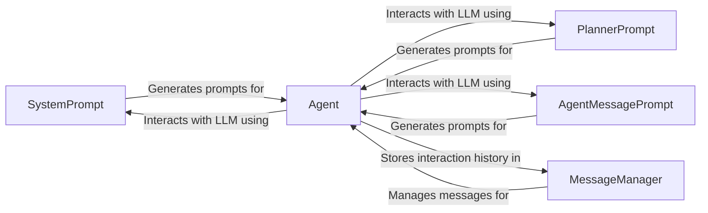

## Component Details

The LLM Interaction subsystem is responsible for managing the communication between the agent and the LLM. It encompasses prompt generation, message handling, and interaction orchestration. The core flow involves the agent utilizing prompts (SystemPrompt, PlannerPrompt, AgentMessagePrompt) to communicate with the LLM, with the MessageManager maintaining a history of these interactions. The Agent orchestrates the entire process, ensuring effective and secure communication with the LLM.

### SystemPrompt
The SystemPrompt component is responsible for generating the initial system prompt that provides context and instructions to the LLM. It sets the stage for the interaction and guides the LLM's behavior by defining the overall goals and constraints.
- **Related Classes/Methods**: `browser_use.agent.prompts.SystemPrompt`

### PlannerPrompt
The PlannerPrompt component generates prompts specifically for the planning phase. It guides the LLM to create a plan of action for the agent to follow, breaking down complex tasks into smaller, manageable steps.
- **Related Classes/Methods**: `browser_use.agent.prompts.PlannerPrompt`

### AgentMessagePrompt
The AgentMessagePrompt component generates prompts for general communication with the LLM during the agent's operation. This includes user messages, requests for information, and any other communication needed to fulfill the agent's tasks.
- **Related Classes/Methods**: `browser_use.agent.prompts.AgentMessagePrompt`

### MessageManager
The MessageManager component manages the history of messages exchanged between the agent and the LLM. This includes prompts, responses, and internal state messages. It also handles token counting and filtering of sensitive data to ensure secure and efficient communication.
- **Related Classes/Methods**: `browser_use.agent.message_manager.service.MessageManager`, `browser_use.agent.message_manager.views.MessageHistory`

### Agent
The Agent component is the central orchestrator of the interaction with the LLM. It utilizes the prompts generated by the prompt components to communicate with the LLM, receives the LLM's output, and uses the MessageManager to store the interaction history. It coordinates the entire process of planning and execution.
- **Related Classes/Methods**: `browser_use.agent.service.Agent`