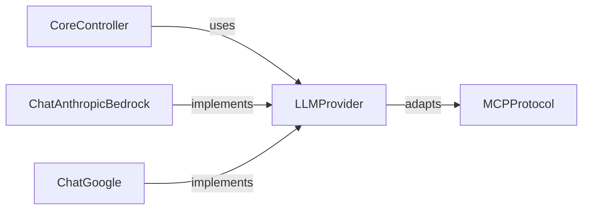

## Details

One paragraph explaining the functionality which is represented by this graph. What the main flow is and what is its purpose.

### LLMProvider
Abstract interface defining the contract for all LLM providers, including token cost tracking and response serialization requirements

**Related Classes/Methods**:

- <a href="https://github.com/browser-use/browser-use/blob/main/browser_use/llm/base.py#L12-L45" target="_blank" rel="noopener noreferrer">`browser_use.llm.base.BaseChatModel` (12:45)</a>

### ChatAnthropicBedrock
AWS Bedrock-specific implementation of LLMProvider for Anthropic models

**Related Classes/Methods**:

- <a href="https://github.com/browser-use/browser-use/blob/main/browser_use/llm/aws/chat_bedrock.py#L21-L281" target="_blank" rel="noopener noreferrer">`browser_use.llm.aws.chat_bedrock.ChatAWSBedrock` (21:281)</a>
- <a href="https://github.com/browser-use/browser-use/blob/main/browser_use/llm/base.py#L12-L45" target="_blank" rel="noopener noreferrer">`browser_use.llm.base.BaseChatModel` (12:45)</a>

### ChatGoogle
Google Cloud implementation of LLMProvider for Gemini models

**Related Classes/Methods**:

- <a href="https://github.com/browser-use/browser-use/blob/main/browser_use/llm/base.py#L12-L45" target="_blank" rel="noopener noreferrer">`browser_use.llm.base.BaseChatModel` (12:45)</a>
- `browser_use.app.BrowserUseApp` (150:210)

### CoreController
Central coordination component that manages LLM provider selection and protocol communication

**Related Classes/Methods**:

- `browser_use.core.controller.CoreController` (34:150)

### MCPProtocol
Standardized protocol adapter implementing Model Control Protocol for interoperability

**Related Classes/Methods**:

- `browser_use.protocol.mcp.MCPProtocol` (78:210)

### [FAQ](https://github.com/CodeBoarding/GeneratedOnBoardings/tree/main?tab=readme-ov-file#faq)