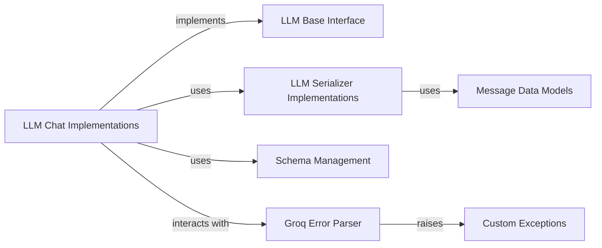

## Details

The `browser_use.llm` subsystem provides a robust and extensible framework for integrating with various Large Language Model (LLM) providers. It achieves this through a clear separation of concerns, defining a foundational interface for LLM interactions, concrete implementations for specific providers, and dedicated components for message serialization, schema management, and error handling. This design promotes modularity, allowing new LLM providers to be integrated seamlessly while maintaining a consistent API for the rest of the application. The core flow involves abstracting LLM interactions, serializing messages for specific providers, and managing structured outputs, with specialized error handling for provider-specific quirks.

### LLM Base Interface
Establishes the foundational abstract interface (`ainvoke`, `get_client`) that all concrete LLM chat implementations must adhere to. It promotes consistency and interchangeability, aligning with the "Plugin/Extension" architectural pattern.

**Related Classes/Methods**:

- <a href="https://github.com/browser-use/browser-use/blob/main/browser_use/llm/base.py" target="_blank" rel="noopener noreferrer">`browser_use.llm.base`</a>

### LLM Chat Implementations
These are the concrete implementations for interacting with specific LLM providers (e.g., OpenAI, Groq, Anthropic). They manage client instances, send requests, process responses, and handle various invocation types (structured output, tool calling). This component represents a collection of modules, each providing a specific LLM integration.

**Related Classes/Methods**:

- <a href="https://github.com/browser-use/browser-use/blob/main/browser_use/llm/openai/chat.py" target="_blank" rel="noopener noreferrer">`browser_use.llm.openai.chat`</a>
- <a href="https://github.com/browser-use/browser-use/blob/main/browser_use/llm/groq/chat.py" target="_blank" rel="noopener noreferrer">`browser_use.llm.groq.chat`</a>
- <a href="https://github.com/browser-use/browser-use/blob/main/browser_use/llm/anthropic/chat.py" target="_blank" rel="noopener noreferrer">`browser_use.llm.anthropic.chat`</a>

### LLM Serializer Implementations
Responsible for translating abstract message objects (text, images, tool calls) into the precise data structures required by each LLM provider's API. This is crucial for handling model-specific communication and data formatting. This component represents a collection of modules, each providing serialization logic for a specific LLM.

**Related Classes/Methods**:

- <a href="https://github.com/browser-use/browser-use/blob/main/browser_use/llm/anthropic/serializer.py" target="_blank" rel="noopener noreferrer">`browser_use.llm.anthropic.serializer`</a>
- <a href="https://github.com/browser-use/browser-use/blob/main/browser_use/llm/groq/serializer.py" target="_blank" rel="noopener noreferrer">`browser_use.llm.groq.serializer`</a>
- <a href="https://github.com/browser-use/browser-use/blob/main/browser_use/llm/openai/serializer.py" target="_blank" rel="noopener noreferrer">`browser_use.llm.openai.serializer`</a>

### Schema Management
Provides utilities for manipulating and optimizing JSON schemas, particularly for LLM interactions requiring structured output or tool definitions. It ensures schema strictness and resolves references, supporting robust data exchange.

**Related Classes/Methods**:

- <a href="https://github.com/browser-use/browser-use/blob/main/browser_use/llm/schema.py" target="_blank" rel="noopener noreferrer">`browser_use.llm.schema`</a>

### Message Data Models
Defines the common data models for various message types (user, assistant, tool messages) and includes utility functions for formatting message content, especially image URLs. This ensures consistent data representation across the layer.

**Related Classes/Methods**:

- <a href="https://github.com/browser-use/browser-use/blob/main/browser_use/llm/messages.py" target="_blank" rel="noopener noreferrer">`browser_use.llm.messages`</a>

### Custom Exceptions
Defines specific exception classes for error conditions within the LLM integration layer, enabling robust and granular error handling.

**Related Classes/Methods**:

- <a href="https://github.com/browser-use/browser-use/blob/main/browser_use/llm/exceptions.py" target="_blank" rel="noopener noreferrer">`browser_use.llm.exceptions`</a>

### Groq Error Parser
A specialized component for parsing and handling error responses specifically from Groq LLMs, including correcting malformed JSON. This demonstrates a pattern of handling provider-specific quirks.

**Related Classes/Methods**:

- <a href="https://github.com/browser-use/browser-use/blob/main/browser_use/llm/groq/parser.py" target="_blank" rel="noopener noreferrer">`browser_use.llm.groq.parser`</a>

### [FAQ](https://github.com/CodeBoarding/GeneratedOnBoardings/tree/main?tab=readme-ov-file#faq)