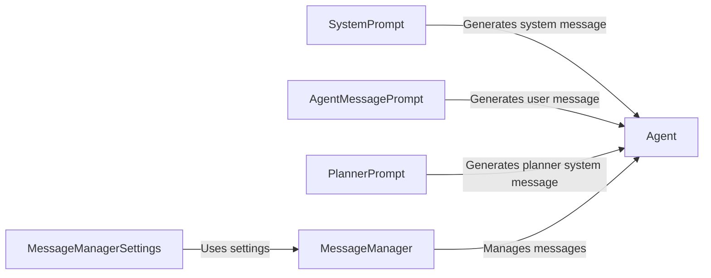

## Component Details

The Language Model Interaction subsystem is responsible for managing the communication between the agent and the language model. It encompasses the creation and management of prompts, as well as the storage and retrieval of messages exchanged during the interaction. The core components include prompt generation (SystemPrompt, PlannerPrompt, AgentMessagePrompt) and message management (MessageManager), ensuring effective and context-aware communication with the LLM.

### SystemPrompt
The SystemPrompt component is responsible for generating the initial system message that sets the context and instructions for the language model. It defines the agent's role, capabilities, and constraints, guiding the LLM's behavior throughout the interaction.
- **Related Classes/Methods**: `browser_use.agent.prompts.SystemPrompt`

### PlannerPrompt
The PlannerPrompt component generates the system message specifically for the planning phase. It instructs the LLM on how to create a plan of action to achieve the desired goal, outlining the steps and considerations for effective task execution.
- **Related Classes/Methods**: `browser_use.agent.prompts.PlannerPrompt`

### AgentMessagePrompt
The AgentMessagePrompt component creates user messages based on the agent's current state and the task at hand. It formulates specific instructions or queries for the LLM, providing the necessary context and guidance for each interaction turn.
- **Related Classes/Methods**: `browser_use.agent.prompts.AgentMessagePrompt`

### MessageManager
The MessageManager component manages the message history between the agent and the LLM. It stores, retrieves, and manipulates messages, ensuring that the LLM has access to the relevant context for informed decision-making. It also handles token counting and message truncation to stay within the LLM's context window limits.
- **Related Classes/Methods**: `browser_use.agent.message_manager.service.MessageManager`

### MessageManagerSettings
The MessageManagerSettings component defines the configuration settings for the MessageManager, such as the maximum number of tokens to store in the message history and the truncation strategy. These settings control the behavior of the MessageManager and ensure efficient resource utilization.
- **Related Classes/Methods**: `browser_use.agent.message_manager.service.MessageManagerSettings`

### Agent
The Agent component orchestrates the interaction with the LLM, utilizing prompts and the MessageManager to guide the browser automation process. It leverages the prompts to provide instructions to the LLM and uses the MessageManager to maintain context and manage the conversation history.
- **Related Classes/Methods**: `browser_use.agent.service.Agent`