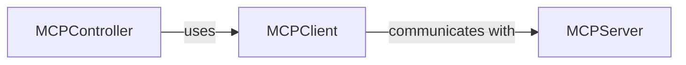

## Details

The `MCP (Model Context Protocol) Client/Server` subsystem is a critical part of the `browser-use` project, enabling the AI agent to interact with external services and expose its own capabilities.

### MCPClient
This component is responsible for initiating and managing outgoing communication with external services that adhere to the Model Context Protocol. It acts as the `browser-use` agent's interface for consuming capabilities (tools) exposed by other MCP-compliant services. Its key responsibilities include establishing connections, registering the agent's own capabilities with a remote controller (if acting as a tool provider), and formatting/sending tool invocation requests.

**Related Classes/Methods**:

- <a href="https://github.com/browser-use/browser-use/blob/main/browser_use/mcp/client.py" target="_blank" rel="noopener noreferrer">`browser_use.mcp.client`</a>

### MCPServer
This component is responsible for handling incoming requests from MCP clients. Its primary role is to expose the `browser-use` agent's internal browser automation capabilities (e.g., navigation, clicking, typing) as callable tools to external MCP clients. It processes tool invocation requests, executes the corresponding browser actions, and manages the lifecycle of the browser session.

**Related Classes/Methods**:

- <a href="https://github.com/browser-use/browser-use/blob/main/browser_use/mcp/server.py" target="_blank" rel="noopener noreferrer">`browser_use.mcp.server`</a>

### MCPController
This component acts as the internal orchestrator within the `browser-use` agent for managing MCP connections and integrating external MCP tools. It bridges the gap between the agent's core logic and external MCP services, allowing the agent to discover and utilize tools provided by other MCP-compliant entities. It uses the `MCPClient` to establish connections and register tools.

**Related Classes/Methods**:

- <a href="https://github.com/browser-use/browser-use/blob/main/browser_use/mcp/controller.py" target="_blank" rel="noopener noreferrer">`browser_use.mcp.controller`</a>

### [FAQ](https://github.com/CodeBoarding/GeneratedOnBoardings/tree/main?tab=readme-ov-file#faq)