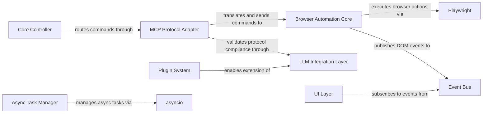

## Details

The architecture implements a browser automation system with protocol translation (MCP), command execution, and LLM integration. The main flow starts with protocol message translation, followed by command execution through browser automation, with LLM validation ensuring protocol compliance. Events are published through a centralized event bus to support real-time UI updates and monitoring.

### MCP Protocol Adapter [[Expand]](./MCP_Protocol_Adapter.md)
Translates MCP protocol messages to browser commands and validates protocol compliance

**Related Classes/Methods**:

- `browser_use.mcp.MCPAdapter` (1:50)

### Browser Automation Core [[Expand]](./Browser_Automation_Core.md)
Direct browser control via Playwright, DOM manipulation, and element interaction

**Related Classes/Methods**:

- `browser_use.browser.Browser`

### Core Controller
Command routing, execution coordination, and agent state management

**Related Classes/Methods**:

- `browser_use.core.Controller` (1:80)

### LLM Integration Layer [[Expand]](./LLM_Integration_Layer.md)
LLM provider abstraction, response parsing, and action planning

**Related Classes/Methods**:

- `browser_use.llm.LLMProvider` (1:60)

### Async Task Manager
Concurrent task scheduling, resource management, and asyncio coordination

**Related Classes/Methods**:

- `browser_use.tasks.TaskManager` (1:40)

### Plugin System
Extensibility framework for new LLM providers and browser capabilities

**Related Classes/Methods**:

- `browser_use.plugins.PluginManager` (1:30)

### Event Bus
Centralized event routing for DOM changes, command status, and errors

**Related Classes/Methods**:

- `browser_use.events.EventBus` (1:25)

### UI Layer
User interaction interface, agent monitoring, and debugging tools

**Related Classes/Methods**:

- `browser_use.ui.UserInterface` (1:35)

### [FAQ](https://github.com/CodeBoarding/GeneratedOnBoardings/tree/main?tab=readme-ov-file#faq)