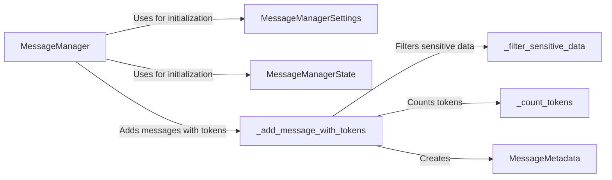

## Component Details

### MessageManager
The central class responsible for managing the message history. It handles adding new messages, filtering sensitive data, counting tokens, and ensuring the message history stays within token limits.
- **Related Classes/Methods**: `browser_use.agent.message_manager.service.MessageManager`

### MessageManagerSettings
Configuration settings for the MessageManager, including token limits and sensitive data patterns used for filtering.
- **Related Classes/Methods**: `browser_use.agent.message_manager.service.MessageManagerSettings`

### MessageManagerState
Represents the state of the messages managed by the MessageManager, storing the message history.
- **Related Classes/Methods**: `browser_use.agent.message_manager.views.MessageManagerState`

### _add_message_with_tokens
A method within MessageManager that adds a message to the history, first filtering sensitive data and then counting the tokens in the message.
- **Related Classes/Methods**: `browser_use.agent.message_manager.service.MessageManager._add_message_with_tokens`

### _filter_sensitive_data
A method within MessageManager that filters sensitive information from the message content before it is added to the history.
- **Related Classes/Methods**: `browser_use.agent.message_manager.service.MessageManager._filter_sensitive_data`

### _count_tokens
A method within MessageManager that counts the number of tokens in a message to ensure the history stays within token limits.
- **Related Classes/Methods**: `browser_use.agent.message_manager.service.MessageManager._count_tokens`

### MessageMetadata
Stores metadata associated with a message, such as the number of tokens. This metadata is used by the MessageManager to manage token limits.
- **Related Classes/Methods**: `browser_use.agent.message_manager.views.MessageMetadata`
