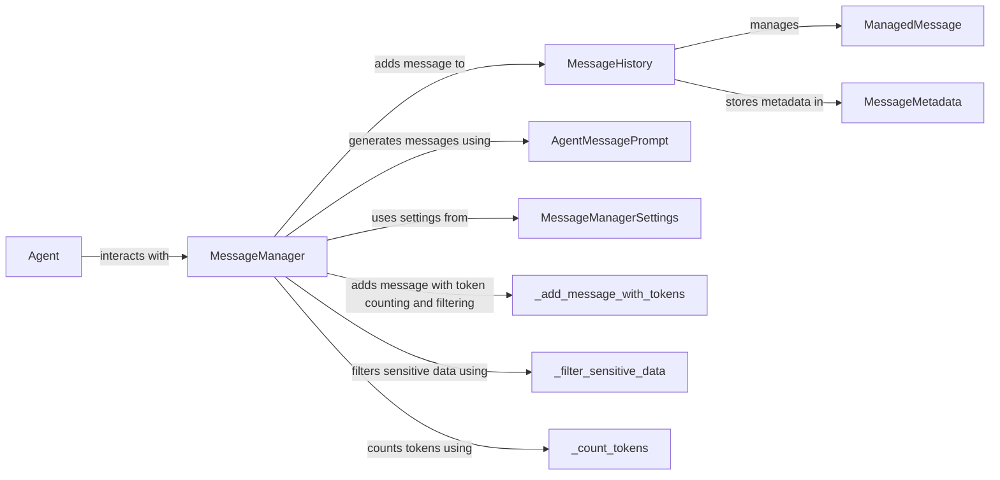

## Component Details

The Message Manager component orchestrates the handling of messages between the agent and the language model. It maintains a history of messages, filters sensitive information, counts tokens to manage context window size, and formats messages for the LLM. The core functionality revolves around adding messages, managing their size, and ensuring the agent's communication is both effective and secure.

### MessageManager
The MessageManager class is the central component responsible for managing the message history, including adding new tasks, state messages, model outputs, and plans. It interacts with the Agent to receive messages and the MessageHistory to store and retrieve them. It also handles filtering sensitive data, counting tokens, and cutting messages to manage the size of the message history.
- **Related Classes/Methods**: `browser_use.agent.message_manager.service.MessageManager`

### MessageHistory
The MessageHistory class is responsible for storing and managing the history of messages. It provides methods for adding new messages, retrieving existing messages, and managing the overall size of the message history. It interacts with the MessageManager to receive new messages and the ManagedMessage to store individual messages.
- **Related Classes/Methods**: `browser_use.agent.message_manager.views.MessageHistory`

### ManagedMessage
The ManagedMessage class represents a single message within the message history. It stores the content of the message, as well as any associated metadata. It is managed by the MessageHistory.
- **Related Classes/Methods**: `browser_use/browser_use/agent/message_manager/views.py.ManagedMessage`

### MessageMetadata
The MessageMetadata class stores metadata associated with a message, such as timestamps or other relevant information. It is used by the MessageHistory to store additional information about each message.
- **Related Classes/Methods**: `browser_use.agent.message_manager.views.MessageMetadata`

### AgentMessagePrompt
The AgentMessagePrompt class is responsible for generating user-facing messages based on the agent's state and actions. It is used by the MessageManager to format messages for the LLM.
- **Related Classes/Methods**: `browser_use.agent.prompts.AgentMessagePrompt`

### MessageManagerSettings
The MessageManagerSettings class holds configuration settings for the MessageManager, such as token limits or sensitive data patterns. It is used by the MessageManager to configure its behavior.
- **Related Classes/Methods**: `browser-use/browser_use/agent/message_manager/service.py.MessageManagerSettings`

### _add_message_with_tokens
A method within MessageManager that adds a message to the history, also handling token counting and filtering. It is a core part of the message processing pipeline.
- **Related Classes/Methods**: `browser-use/browser_use/agent/message_manager/service.py.MessageManager._add_message_with_tokens`

### _filter_sensitive_data
A method within MessageManager that filters sensitive information from messages. It ensures that sensitive data is not exposed to the LLM.
- **Related Classes/Methods**: `browser-use/browser_use/agent/message_manager/service.py.MessageManager._filter_sensitive_data`

### _count_tokens
A method within MessageManager that counts the number of tokens in a message. It is used to manage the size of the message history and prevent exceeding the LLM's context window.
- **Related Classes/Methods**: `browser-use/browser_use/agent/message_manager/service.py.MessageManager._count_tokens`

### Agent
The Agent class is responsible for orchestrating the steps of the agent, including adding new tasks, handling errors, running the planner, and interacting with the MessageManager to manage messages. It provides the messages to be managed.
- **Related Classes/Methods**: `browser_use.agent.service.Agent`