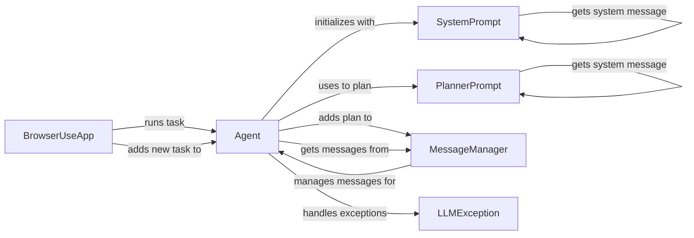

## Component Details

### BrowserUseApp
The main application class responsible for running tasks. It initializes the agent and triggers the task execution.
- **Related Classes/Methods**: `browser_use.cli.BrowserUseApp:run_task`

### Agent
The agent service is responsible for planning and executing tasks. It uses prompts to generate plans, interacts with a message manager to maintain context, and handles exceptions during task execution.
- **Related Classes/Methods**: `browser_use.agent.service.Agent`, `browser_use.agent.service.Agent:__init__`, `browser_use.agent.service.Agent:add_new_task`, `browser_use.agent.service.Agent:run`, `browser_use.agent.service.Agent:step`, `browser_use.agent.service.Agent:_run_planner`, `browser_use.agent.service.Agent._remove_think_tags`

### SystemPrompt
Generates the system prompt for the agent, providing initial instructions and context.
- **Related Classes/Methods**: `browser_use.agent.prompts.SystemPrompt`, `browser_use.agent.prompts.SystemPrompt.get_system_message`

### PlannerPrompt
Generates the prompt used by the agent to create a plan of action. This prompt guides the LLM in creating a sequence of steps to achieve the desired goal.
- **Related Classes/Methods**: `browser_use.agent.prompts.PlannerPrompt`, `browser_use.agent.prompts.PlannerPrompt.get_system_message`

### MessageManager
Manages the messages and conversation history of the agent, providing context for planning and execution. It stores and retrieves messages, including plans, to maintain a coherent conversation history.
- **Related Classes/Methods**: `browser_use.agent.message_manager.service.MessageManager`, `browser_use.agent.message_manager.service.MessageManager.add_plan`, `browser_use.agent.message_manager.service.MessageManager.get_messages`

### LLMException
Exception raised when there is an issue with the LLM.
- **Related Classes/Methods**: `browser_use.exceptions.LLMException`
