```mermaid
graph LR
    SignalHandler["SignalHandler"]
    Agent["Agent"]
    SignalHandler___init__["SignalHandler.__init__"]
    SignalHandler_register["SignalHandler.register"]
    SignalHandler_sigint_handler["SignalHandler.sigint_handler"]
    SignalHandler__handle_second_ctrl_c["SignalHandler._handle_second_ctrl_c"]
    SignalHandler__cancel_interruptible_tasks["SignalHandler._cancel_interruptible_tasks"]
    SignalHandler_wait_for_resume["SignalHandler.wait_for_resume"]
    Agent_run["Agent.run"]
    Agent -- "uses" --> SignalHandler
    Agent_run -- "initializes" --> SignalHandler___init__
    Agent_run -- "registers signal handlers" --> SignalHandler_register
    SignalHandler_register -- "handles SIGINT" --> SignalHandler_sigint_handler
    SignalHandler_sigint_handler -- "handles second Ctrl+C" --> SignalHandler__handle_second_ctrl_c
    SignalHandler_sigint_handler -- "cancels interruptible tasks" --> SignalHandler__cancel_interruptible_tasks
    SignalHandler_wait_for_resume -- "waits for resume" --> SignalHandler__handle_second_ctrl_c
    click SignalHandler href "https://github.com/CodeBoarding/GeneratedOnBoardings/blob/main/browser-use/SignalHandler.md" "Details"
    click Agent href "https://github.com/CodeBoarding/GeneratedOnBoardings/blob/main/browser-use/Agent.md" "Details"
    click SignalHandler___init__ href "https://github.com/CodeBoarding/GeneratedOnBoardings/blob/main/browser-use/SignalHandler.__init__.md" "Details"
    click SignalHandler_register href "https://github.com/CodeBoarding/GeneratedOnBoardings/blob/main/browser-use/SignalHandler.register.md" "Details"
    click SignalHandler_sigint_handler href "https://github.com/CodeBoarding/GeneratedOnBoardings/blob/main/browser-use/SignalHandler.sigint_handler.md" "Details"
    click SignalHandler__handle_second_ctrl_c href "https://github.com/CodeBoarding/GeneratedOnBoardings/blob/main/browser-use/SignalHandler._handle_second_ctrl_c.md" "Details"
    click SignalHandler__cancel_interruptible_tasks href "https://github.com/CodeBoarding/GeneratedOnBoardings/blob/main/browser-use/SignalHandler._cancel_interruptible_tasks.md" "Details"
    click SignalHandler_wait_for_resume href "https://github.com/CodeBoarding/GeneratedOnBoardings/blob/main/browser-use/SignalHandler.wait_for_resume.md" "Details"
    click Agent_run href "https://github.com/CodeBoarding/GeneratedOnBoardings/blob/main/browser-use/Agent.run.md" "Details"
```

## Component Details

The Signal Handler component ensures the application gracefully handles system signals like SIGINT (Ctrl+C) and SIGTERM. It registers signal handlers, manages interruptible tasks, and provides mechanisms for graceful shutdown and resumption. The Agent utilizes the SignalHandler to respond to system events, preventing data loss and ensuring a clean exit. The SignalHandler allows registering and unregistering tasks that can be interrupted, and handles the interruption and resumption logic.

### SignalHandler
The SignalHandler class is responsible for registering signal handlers for SIGINT (Ctrl+C) and SIGTERM, managing interruptible tasks, and providing mechanisms for graceful shutdown and resumption of the agent. It allows registering and unregistering tasks that can be interrupted, and handles the interruption and resumption logic.
- **Related Classes/Methods**: `browser-use.browser_use.utils.SignalHandler`

### Agent
The Agent class represents the main agent service. It initializes and runs the agent, utilizing the SignalHandler to handle signals for graceful shutdown and resumption. The Agent's `run` method interacts with the SignalHandler to register, reset, and unregister signal handling during its lifecycle.
- **Related Classes/Methods**: `browser_use.agent.service.Agent`

### SignalHandler.__init__
Initializes the SignalHandler, setting up the loop state and internal flags.
- **Related Classes/Methods**: `browser-use.browser_use.utils.SignalHandler`

### SignalHandler.register
Registers the signal handlers for SIGINT and SIGTERM.
- **Related Classes/Methods**: `browser-use.browser_use.utils.SignalHandler`

### SignalHandler.sigint_handler
Handles the SIGINT signal (Ctrl+C), triggering interruption of tasks and potentially initiating shutdown.
- **Related Classes/Methods**: `browser-use.browser_use.utils.SignalHandler`

### SignalHandler._handle_second_ctrl_c
Handles the second Ctrl+C signal, forcing a shutdown if the first interrupt signal was not handled.
- **Related Classes/Methods**: `browser-use.browser_use.utils.SignalHandler`

### SignalHandler._cancel_interruptible_tasks
Cancels all registered interruptible tasks.
- **Related Classes/Methods**: `browser-use.browser_use.utils.SignalHandler`

### SignalHandler.wait_for_resume
Waits for the agent to resume after being interrupted.
- **Related Classes/Methods**: `browser-use.browser_use.utils.SignalHandler`

### Agent.run
Runs the agent service, including registering and unregistering signal handlers using the SignalHandler.
- **Related Classes/Methods**: `browser_use.agent.service.Agent`