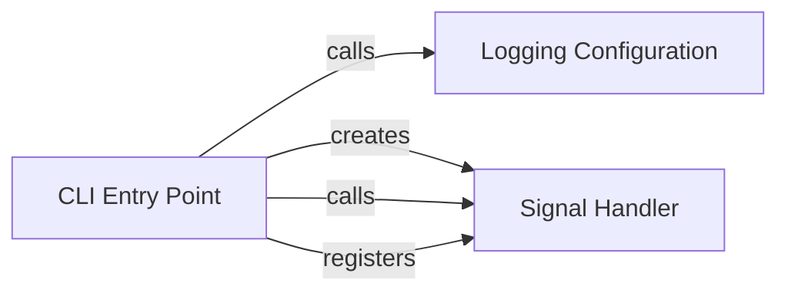

## Component Details

The system configuration subsystem is responsible for setting up the application's environment. This includes configuring logging to capture application behavior and setting up signal handling to gracefully manage interruptions. The CLI entry point initializes these configurations, ensuring the application starts with proper logging and interruption handling capabilities.

### CLI Entry Point
The main entry point of the CLI application. It initializes logging, sets up the signal handler, and registers it to handle SIGINT signals.
- **Related Classes/Methods**: `browser_use.browser_use.cli:main`

### Logging Configuration
Configures the logging system for the application, setting up handlers and formatters to capture log messages. It uses the `rich` library for enhanced logging output.
- **Related Classes/Methods**: `browser_use.browser_use.logging_config:setup_logging`

### Signal Handler
Handles signals, specifically SIGINT, allowing the application to gracefully handle interruptions and resume execution. It provides a mechanism to pause and resume the application based on signal events.
- **Related Classes/Methods**: `browser_use.browser_use.utils.SignalHandler:__init__`, `browser_use.browser_use.utils.SignalHandler:register`, `browser_use.browser_use.utils.SignalHandler:sigint_handler`, `browser_use.browser_use.utils.SignalHandler:wait_for_resume`
