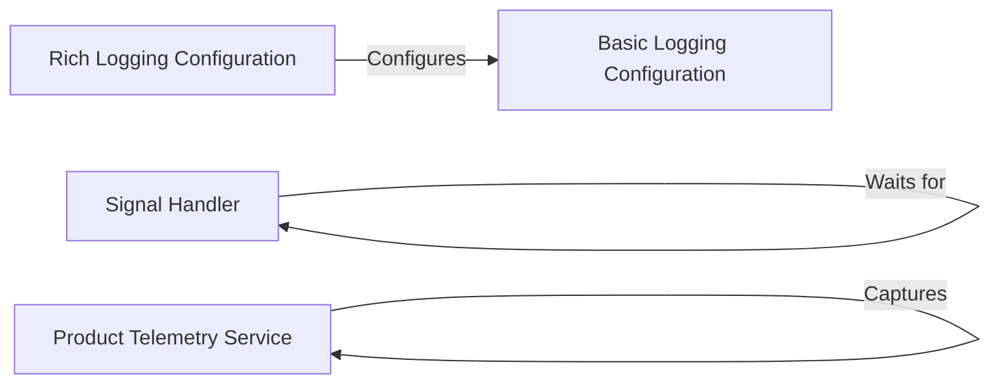

## Component Details

The System Services component provides essential functionalities for the application, including logging, telemetry, and signal handling. It configures logging using either basic or rich configurations, captures product usage telemetry, and manages signals for graceful shutdowns and resumptions. These services ensure the application runs smoothly, collects valuable data, and can be managed effectively.

### Rich Logging Configuration
Configures rich logging using the `rich` library for enhanced console output, including colors and formatting. This helps in making the logs more readable and debuggable.
- **Related Classes/Methods**: `browser_use.browser_use.cli:setup_richlog_logging`

### Basic Logging Configuration
Sets up basic logging for the application using the standard `logging` module, defining log levels and output formats. This provides a standard way to log application events and errors.
- **Related Classes/Methods**: `browser_use.browser_use.logging_config:setup_logging`

### Signal Handler
Handles signals such as SIGINT (Ctrl+C) to allow for graceful shutdown and resumption of the application. It registers signal handlers and provides a mechanism to wait for a resume signal, ensuring the application can be stopped and started cleanly.
- **Related Classes/Methods**: `browser_use.browser_use.utils.SignalHandler:__init__`, `browser_use.browser_use.utils.SignalHandler:register`, `browser_use.browser_use.utils.SignalHandler:sigint_handler`, `browser_use.browser_use.utils.SignalHandler:wait_for_resume`

### Product Telemetry Service
Captures telemetry data related to product usage, such as feature usage and performance metrics, for analysis and improvement. This data helps in understanding how the application is being used and identifying areas for optimization.
- **Related Classes/Methods**: `browser_use.browser_use.telemetry.service.ProductTelemetry:capture`