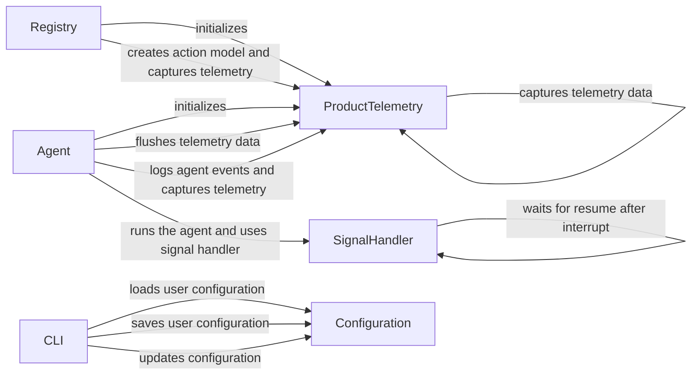

## Component Details

The System Support component provides essential utilities for managing the application's lifecycle, capturing usage data, and handling configuration. It ensures the application can be configured, monitored, and gracefully shut down, contributing to the overall stability and maintainability of the system. The main flow involves loading configurations via the CLI, capturing telemetry data during application usage, and managing signals for graceful shutdown.

### CLI
The CLI component handles command-line interface functionalities, including loading, updating, and saving user configurations. It uses `click` to define the command-line interface and interacts with the configuration files, allowing users to customize the application's behavior through command-line arguments and configuration files.
- **Related Classes/Methods**: `browser_use.browser_use.cli`

### Agent
The Agent component is responsible for running the main application loop, managing the agent's lifecycle, and interacting with other services such as SignalHandler and ProductTelemetry. It orchestrates the core functionality of the application, ensuring that the application runs smoothly and interacts with other components as needed.
- **Related Classes/Methods**: `browser_use.agent.service.Agent`

### SignalHandler
The SignalHandler component manages signal handling for interrupts (SIGINT) and termination (SIGTERM), allowing for graceful shutdown and cleanup of resources. It registers signal handlers and provides a mechanism to wait for resume after an interrupt, ensuring that the application can shut down cleanly and avoid data loss or corruption.
- **Related Classes/Methods**: `browser_use.utils.SignalHandler`

### ProductTelemetry
The ProductTelemetry component captures and manages telemetry data, providing insights into application usage and performance. It handles capturing different telemetry events and flushing them to a backend, allowing developers to monitor application usage and identify areas for improvement.
- **Related Classes/Methods**: `browser_use.telemetry.service.ProductTelemetry`

### Configuration
The Configuration component is responsible for managing the application's configuration settings. It provides methods for loading, saving, and updating the configuration, ensuring that the application can be customized and configured according to user preferences and system requirements.
- **Related Classes/Methods**: `browser_use.browser_use.cli:load_user_config`, `browser_use.browser_use.cli:get_default_config`, `browser_use.browser_use.cli:save_user_config`, `browser_use.browser_use.cli:update_config_with_click_args`

### Registry
The Registry component manages the registration of controller functions and creates action models, capturing telemetry events related to registered functions. It acts as a central point for registering and managing actions within the application, ensuring that all actions are properly tracked and managed.
- **Related Classes/Methods**: `browser_use.controller.registry.service.Registry`