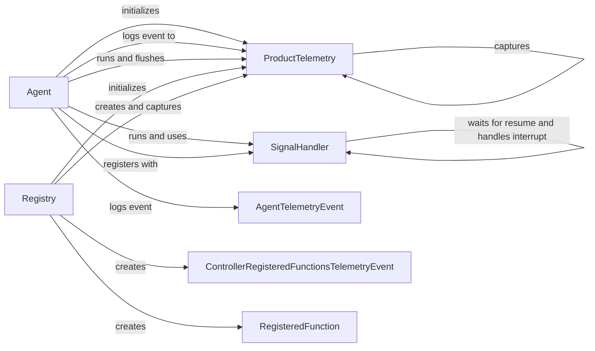

## Component Details

The System Utilities component provides essential supporting functionalities for the agent, including telemetry data capture and reporting, and signal handling for graceful shutdown. The component ensures the agent's stability, provides insights into its performance, and allows for controlled termination.

### ProductTelemetry
The ProductTelemetry service is responsible for capturing and flushing telemetry data, providing insights into the agent's performance and usage. It offers methods for capturing various telemetry events and flushing the data to a backend for analysis.
- **Related Classes/Methods**: `browser-use.browser_use.telemetry.service.ProductTelemetry`

### SignalHandler
The SignalHandler class manages signal handling, enabling graceful shutdown of the agent upon receiving signals like SIGINT and SIGTERM. It registers signal handlers and provides mechanisms for interrupting and resuming tasks, ensuring a controlled termination process.
- **Related Classes/Methods**: `browser-use.browser_use.utils.SignalHandler`

### Agent
The Agent service orchestrates the main loop of the agent, handling signal registration and logging agent-related telemetry events. It interacts with the SignalHandler for graceful shutdown and ProductTelemetry for capturing telemetry data, ensuring the agent's smooth operation and controlled termination.
- **Related Classes/Methods**: `browser-use.browser_use.agent.service.Agent`

### Registry
The Registry service is responsible for creating action models and capturing telemetry data related to registered functions. It interacts with the ProductTelemetry service to capture telemetry events, providing insights into the usage of registered functions.
- **Related Classes/Methods**: `browser-use.browser_use.controller.registry.service.Registry`

### AgentTelemetryEvent
Represents a telemetry event specifically related to the agent's operation, capturing data points relevant to its performance and usage.
- **Related Classes/Methods**: `browser-use.browser_use.telemetry.views.AgentTelemetryEvent`

### ControllerRegisteredFunctionsTelemetryEvent
Represents a telemetry event related to registered controller functions, providing insights into their usage and performance.
- **Related Classes/Methods**: `browser-use.browser_use.telemetry.views.ControllerRegisteredFunctionsTelemetryEvent`

### RegisteredFunction
Represents a registered function within the system, encapsulating its metadata and facilitating telemetry capture related to its execution.
- **Related Classes/Methods**: `browser-use.browser_use.telemetry.views.RegisteredFunction`