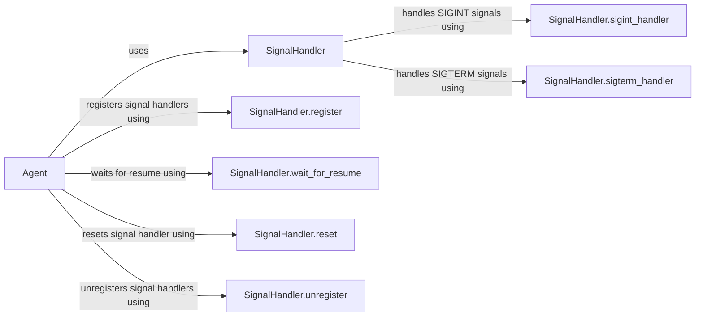

## Component Details

The System Utilities component provides essential functionalities for managing the application's lifecycle, particularly signal handling. It enables the application to gracefully respond to external signals like SIGINT (Ctrl+C) and SIGTERM, allowing for controlled shutdown and interruption of tasks. The core of this component is the SignalHandler class, which registers signal handlers, manages interruptible tasks, and provides mechanisms for pausing and resuming the agent's operation. This ensures the stability and reliability of the application by preventing abrupt terminations and allowing for orderly cleanup.

### SignalHandler
The SignalHandler class is responsible for registering signal handlers for SIGINT and SIGTERM, managing interruptible tasks, and providing mechanisms for pausing and resuming the agent's operation. It allows the agent to respond gracefully to external signals.
- **Related Classes/Methods**: `browser-use.browser_use.utils.SignalHandler`

### Agent
The Agent class represents the main agent service. It initializes and runs the agent, utilizing the SignalHandler to manage its lifecycle. The Agent interacts with the SignalHandler to register signal handlers, wait for resume signals, and reset/unregister handlers during shutdown.
- **Related Classes/Methods**: `browser_use.agent.service.Agent`

### SignalHandler.register
Registers signal handlers for SIGINT and SIGTERM, associating them with specific handler methods.
- **Related Classes/Methods**: `browser-use.browser_use.utils.SignalHandler`

### SignalHandler.sigint_handler
Handles SIGINT signals, triggering interruptible task cancellation and managing subsequent Ctrl+C presses.
- **Related Classes/Methods**: `browser-use.browser_use.utils.SignalHandler`

### SignalHandler.sigterm_handler
Handles SIGTERM signals, triggering interruptible task cancellation.
- **Related Classes/Methods**: `browser-use.browser_use.utils.SignalHandler`

### SignalHandler.wait_for_resume
Pauses the agent's execution until a resume signal is received, allowing for temporary interruption.
- **Related Classes/Methods**: `browser-use.browser_use.utils.SignalHandler`

### SignalHandler.reset
Resets the signal handler state, cleaning up any pending interruptible tasks.
- **Related Classes/Methods**: `browser-use.browser_use.utils.SignalHandler`

### SignalHandler.unregister
Unregisters the signal handlers, removing them from the signal handling mechanism.
- **Related Classes/Methods**: `browser-use.browser_use.utils.SignalHandler`
