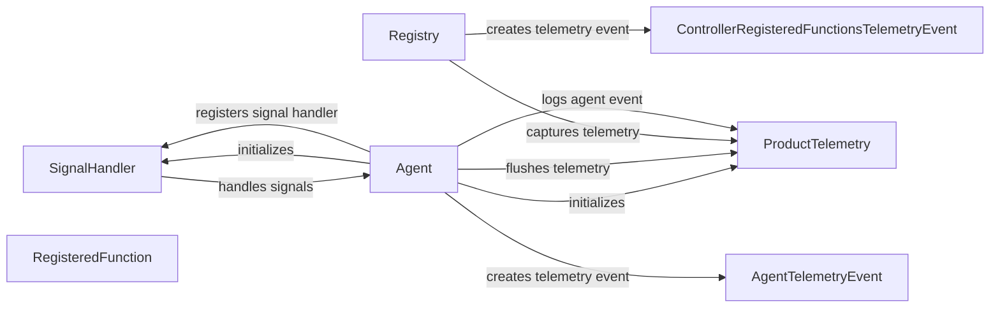

## Component Details

The Telemetry & System Handling subsystem is responsible for capturing telemetry data to monitor the system's performance and usage, as well as handling system signals to ensure graceful shutdown or restart. It comprises components for signal handling, telemetry collection, and integration with other parts of the system like the agent and controller registry. The main flow involves the agent initializing the signal handler and telemetry service, capturing events during operation, and flushing the telemetry data upon shutdown. The signal handler ensures that the agent can gracefully terminate upon receiving signals like SIGINT or SIGTERM.

### SignalHandler
The SignalHandler component manages system signals (SIGINT, SIGTERM) to enable graceful shutdown of the agent. It registers signal handlers, manages interruptible tasks, and ensures proper cleanup. It allows the agent to respond to external signals and terminate in a controlled manner, preventing data loss or corruption.
- **Related Classes/Methods**: `browser_use.utils.SignalHandler`

### ProductTelemetry
The ProductTelemetry component collects and captures telemetry data related to the agent's operation and controller registry. It provides methods for capturing events, flushing the data, and directly capturing telemetry. It allows for monitoring the agent's performance, usage patterns, and potential issues.
- **Related Classes/Methods**: `browser_use.telemetry.service.ProductTelemetry`

### Registry
The Registry component manages the registration of controller functions and captures telemetry data related to registered functions. It creates telemetry events for registered functions and interacts with the ProductTelemetry component to capture this data. It provides insights into the usage and performance of registered controller functions.
- **Related Classes/Methods**: `browser_use.controller.registry.service.Registry`

### Agent
The Agent component is the main service that runs the browser automation. It initializes the SignalHandler and ProductTelemetry components, captures telemetry events, and manages the agent's lifecycle. It registers signal handlers, flushes telemetry data, and ensures proper cleanup upon shutdown. It orchestrates the overall operation of the agent and its interaction with other components.
- **Related Classes/Methods**: `browser_use.agent.service.Agent`

### AgentTelemetryEvent
The AgentTelemetryEvent component represents a telemetry event specific to the agent's operation. It encapsulates data related to agent events and is used by the ProductTelemetry component to capture and report telemetry data.
- **Related Classes/Methods**: `browser_use.telemetry.views.AgentTelemetryEvent`

### ControllerRegisteredFunctionsTelemetryEvent
The ControllerRegisteredFunctionsTelemetryEvent component represents a telemetry event for registered controller functions. It encapsulates data related to registered functions and is used by the ProductTelemetry component to capture and report telemetry data.
- **Related Classes/Methods**: `browser_use.telemetry.views.ControllerRegisteredFunctionsTelemetryEvent`

### RegisteredFunction
The RegisteredFunction component represents a registered function within the controller registry. It encapsulates information about the registered function and is used by the Registry component to manage and track registered functions.
- **Related Classes/Methods**: `browser_use.telemetry.views.RegisteredFunction`