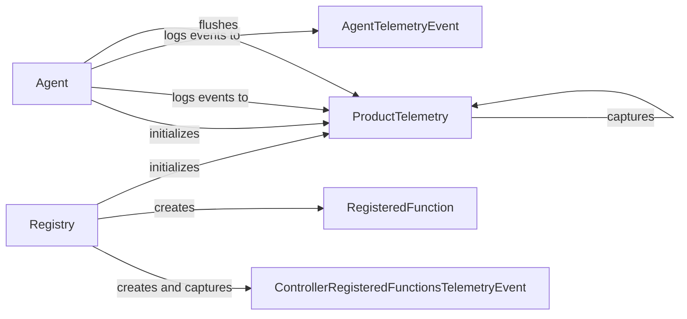

## Component Details

The Telemetry Service captures and transmits usage data to track the performance and behavior of the browser automation system. It records events related to agent actions, controller functions, and other system activities, providing valuable insights for system optimization and improvement. The main flow involves the Agent and Registry components generating telemetry events, which are then captured, stored, and flushed by the ProductTelemetry component to a telemetry backend.

### Registry
The Registry component manages and registers controller actions. It creates action models and associates them with telemetry events, allowing the system to track which controller functions are being used. It is responsible for creating `RegisteredFunction` objects and associating them with `ControllerRegisteredFunctionsTelemetryEvent`.
- **Related Classes/Methods**: `browser_use.controller.registry.service.Registry`

### ProductTelemetry
The ProductTelemetry component handles the capturing, storing, and flushing of telemetry data. It provides methods for capturing different types of events and sending them to a telemetry backend, ensuring that usage data is collected and transmitted for analysis. It interacts with the Agent and Registry components to receive telemetry events.
- **Related Classes/Methods**: `browser_use.telemetry.service.ProductTelemetry`

### Agent
The Agent component is responsible for running tasks and logging agent-related events. It interacts with ProductTelemetry to capture telemetry data during its execution, providing insights into agent behavior and performance. It logs events to `ProductTelemetry` and `AgentTelemetryEvent`.
- **Related Classes/Methods**: `browser_use.agent.service.Agent`

### ControllerRegisteredFunctionsTelemetryEvent
The ControllerRegisteredFunctionsTelemetryEvent component represents a telemetry event specifically for registered controller functions. It captures information about the registration of controller functions, allowing the system to track which functions are available and being used. It is created by the Registry component.
- **Related Classes/Methods**: `browser_use.telemetry.views.ControllerRegisteredFunctionsTelemetryEvent`

### RegisteredFunction
The RegisteredFunction component represents a registered function within the system. It encapsulates the details of a registered function, such as its name and associated metadata, providing a structured way to represent and track functions within the system. It is created by the Registry component.
- **Related Classes/Methods**: `browser_use.telemetry.views.RegisteredFunction`

### AgentTelemetryEvent
The AgentTelemetryEvent component represents a telemetry event related to the agent's activities. It captures information about agent actions and events, providing insights into agent behavior and performance. It is logged to by the Agent component.
- **Related Classes/Methods**: `browser_use.telemetry.views.AgentTelemetryEvent`