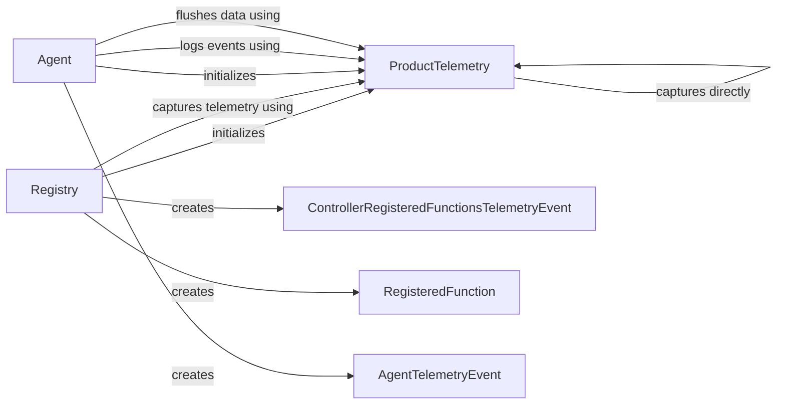

## Component Details

The Telemetry Service collects and reports usage data and errors from various parts of the application, including the agent, controller, and registered functions. It provides a centralized mechanism for capturing events, formatting them into telemetry events, and flushing the data to a backend for analysis and monitoring. The service ensures that valuable insights into application usage and potential issues are captured and made available for further investigation.

### ProductTelemetry
The ProductTelemetry class is the core of the telemetry service, providing methods for capturing and managing telemetry data. It allows capturing events directly or indirectly, and flushing the collected data to a backend. It interacts with the Registry, Agent, and other components to collect telemetry data.
- **Related Classes/Methods**: `browser_use.telemetry.service.ProductTelemetry`

### Registry
The Registry class manages the registration of controller actions and their associated metadata. It creates action models and interacts with the ProductTelemetry service to capture telemetry data related to registered functions.
- **Related Classes/Methods**: `browser_use.controller.registry.service.Registry`

### Agent
The Agent class represents an agent that interacts with the browser. It logs agent-related events and uses the ProductTelemetry service to capture and report these events. It also flushes the telemetry data when the agent is run.
- **Related Classes/Methods**: `browser_use.agent.service.Agent`

### ControllerRegisteredFunctionsTelemetryEvent
The ControllerRegisteredFunctionsTelemetryEvent class represents a telemetry event specifically for registered controller functions. It's a data structure used to format the telemetry data before being captured by ProductTelemetry.
- **Related Classes/Methods**: `browser_use.telemetry.views.ControllerRegisteredFunctionsTelemetryEvent`

### RegisteredFunction
The RegisteredFunction class represents the data structure for a registered function, containing information about the function itself. This information is used when creating the ControllerRegisteredFunctionsTelemetryEvent.
- **Related Classes/Methods**: `browser_use.telemetry.views.RegisteredFunction`

### AgentTelemetryEvent
The AgentTelemetryEvent class represents a telemetry event specific to the agent. It's a data structure used to format the telemetry data before being captured by ProductTelemetry.
- **Related Classes/Methods**: `browser_use.telemetry.views.AgentTelemetryEvent`