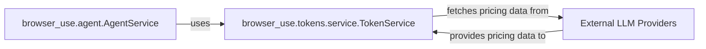

## Details

The Token & Cost Tracking subsystem is crucial for monitoring and managing the expenses associated with Large Language Model (LLM) interactions within the browser-use project. At its core, the TokenService is responsible for fetching and caching LLM pricing data, calculating the cost of operations based on token usage, and providing comprehensive summaries. This subsystem directly integrates with LLM calls initiated by the AgentService to ensure transparent and automatic tracking of all LLM-related costs. External LLM Providers supply the necessary pricing information, enabling the TokenService to accurately attribute costs.

### browser_use.tokens.service.TokenService
This is the central component of the Token & Cost Tracking subsystem. It is responsible for managing LLM pricing data, calculating the cost of LLM interactions, tracking token usage (both input and output), and providing summaries. It also integrates directly with LLM calls to automatically track usage and logs this information.

**Related Classes/Methods**:

- <a href="https://github.com/browser-use/browser-use/blob/main/browser_use/tokens/service.py" target="_blank" rel="noopener noreferrer">`browser_use.tokens.service.TokenService`</a>
- <a href="https://github.com/browser-use/browser-use/blob/main/browser_use/tokens/service.py" target="_blank" rel="noopener noreferrer">`browser_use.tokens.service.TokenService._load_pricing_data`</a>
- <a href="https://github.com/browser-use/browser-use/blob/main/browser_use/tokens/service.py" target="_blank" rel="noopener noreferrer">`browser_use.tokens.service.TokenService.get_model_pricing`</a>
- <a href="https://github.com/browser-use/browser-use/blob/main/browser_use/tokens/service.py" target="_blank" rel="noopener noreferrer">`browser_use.tokens.service.TokenService._fetch_and_cache_pricing_data`</a>
- <a href="https://github.com/browser-use/browser-use/blob/main/browser_use/tokens/service.py" target="_blank" rel="noopener noreferrer">`browser_use.tokens.service.TokenService.calculate_cost`</a>
- <a href="https://github.com/browser-use/browser-use/blob/main/browser_use/tokens/service.py" target="_blank" rel="noopener noreferrer">`browser_use.tokens.service.TokenService.add_usage`</a>
- <a href="https://github.com/browser-use/browser-use/blob/main/browser_use/tokens/service.py" target="_blank" rel="noopener noreferrer">`browser_use.tokens.service.TokenService.get_usage_summary`</a>
- <a href="https://github.com/browser-use/browser-use/blob/main/browser_use/tokens/service.py" target="_blank" rel="noopener noreferrer">`browser_use.tokens.service.TokenService.tracked_ainvoke`</a>
- <a href="https://github.com/browser-use/browser-use/blob/main/browser_use/tokens/service.py" target="_blank" rel="noopener noreferrer">`browser_use.tokens.service.TokenService._log_usage`</a>
- <a href="https://github.com/browser-use/browser-use/blob/main/browser_use/tokens/service.py" target="_blank" rel="noopener noreferrer">`browser_use.tokens.service.TokenService.log_usage_summary`</a>

### External LLM Providers
These represent the various external Large Language Model services (e.g., OpenAI, Anthropic, Google) that provide the actual LLM models and their associated pricing data. The TokenService relies on these providers for up-to-date cost information. This component is external to the project's codebase and therefore does not have direct source code references within the browser-use repository.

**Related Classes/Methods**: _None_

### browser_use.agent.AgentService
As the core orchestrator of AI Agent-driven browser automation, the AgentService is the primary consumer of the Token & Cost Tracking subsystem. It initiates LLM interactions and relies on TokenService to transparently track and report the costs incurred during these operations.

**Related Classes/Methods**:

### [FAQ](https://github.com/CodeBoarding/GeneratedOnBoardings/tree/main?tab=readme-ov-file#faq)