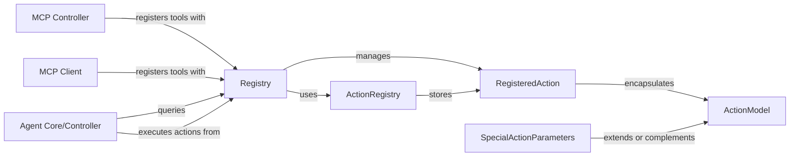

## Details

The Registry acts as the central hub for managing actions within the system, leveraging ActionRegistry for storage and RegisteredAction to encapsulate action details. ActionModel serves as the foundational Pydantic model for defining action parameters, ensuring data integrity. External components like MCP Controller and MCP Client interact with the Registry to register new tools, while the Agent Core/Controller queries the Registry to discover and execute available actions, forming the core operational flow of the system.

### Registry [[Expand]](./Registry.md)
The core service responsible for the lifecycle management of actions, including registration, normalization, and retrieval. It acts as the primary interface for defining and accessing the Agent's capabilities.

**Related Classes/Methods**:

- <a href="https://github.com/browser-use/browser-use/blob/main/browser_use/controller/registry/views.py" target="_blank" rel="noopener noreferrer">`browser_use.controller.registry.views:ActionRegistry`</a>
- <a href="https://github.com/browser-use/browser-use/blob/main/browser_use/controller/registry/views.py" target="_blank" rel="noopener noreferrer">`browser_use.controller.registry.views:RegisteredAction`</a>

### ActionRegistry
A data structure that serves as the repository for all registered actions, providing efficient lookup and storage.

**Related Classes/Methods**:

- <a href="https://github.com/browser-use/browser-use/blob/main/browser_use/controller/registry/views.py" target="_blank" rel="noopener noreferrer">`browser_use.controller.registry.views:RegisteredAction`</a>

### RegisteredAction
A data model representing a single action registered with the system. It encapsulates the action's metadata, including its name, description, and input parameters.

**Related Classes/Methods**:

- <a href="https://github.com/browser-use/browser-use/blob/main/browser_use/controller/registry/views.py" target="_blank" rel="noopener noreferrer">`browser_use.controller.registry.views:ActionModel`</a>

### ActionModel
The base Pydantic model for defining the input parameters of any registered action, ensuring type safety and validation. It includes methods for getting and setting an action's index.

**Related Classes/Methods**:

- <a href="https://github.com/browser-use/browser-use/blob/main/browser_use/controller/registry/views.py" target="_blank" rel="noopener noreferrer">`browser_use.controller.registry.views:ActionModel`</a>

### SpecialActionParameters
Defines the types and structure of context-specific parameters that are automatically injected into actions by the Agent's Controller during execution.

**Related Classes/Methods**:

- <a href="https://github.com/browser-use/browser-use/blob/main/browser_use/controller/registry/views.py" target="_blank" rel="noopener noreferrer">`browser_use.controller.registry.views:ActionModel`</a>

### MCP Controller
A component responsible for integrating external tools defined via the Model Context Protocol (MCP) into the internal action registry by calling the Registry service.

**Related Classes/Methods**:

- <a href="https://github.com/browser-use/browser-use/blob/main/browser_use/controller/registry/service.py" target="_blank" rel="noopener noreferrer">`browser_use.controller.registry.service`</a>

### MCP Client
A component that also interacts with the Registry to register tools, likely for tools it discovers or provides to an MCP server, ensuring they are available to the Agent.

**Related Classes/Methods**:

- <a href="https://github.com/browser-use/browser-use/blob/main/browser_use/controller/registry/service.py" target="_blank" rel="noopener noreferrer">`browser_use.controller.registry.service`</a>

### Agent Core/Controller
The main Agent's Controller component that queries the Registry to discover available actions and then orchestrates their execution based on the Agent's reasoning.

**Related Classes/Methods**:

- <a href="https://github.com/browser-use/browser-use/blob/main/browser_use/controller/registry/service.py" target="_blank" rel="noopener noreferrer">`browser_use.controller.registry.service`</a>

### [FAQ](https://github.com/CodeBoarding/GeneratedOnBoardings/tree/main?tab=readme-ov-file#faq)