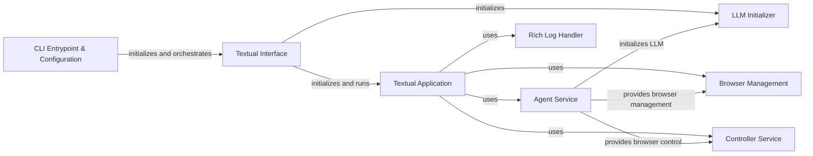

## Component Details

### CLI Entrypoint & Configuration
The `main` function serves as the entry point, orchestrating the loading and updating of user configurations. It combines the functionalities of loading configurations, updating them with command-line arguments, and initializing the Textual interface. It uses `load_user_config` to load the base configuration, `update_config_with_click_args` to apply command-line overrides, and then starts the Textual application.
- **Related Classes/Methods**: `browser_use.cli:main`, `browser_use.cli:load_user_config`, `browser_use.cli:get_default_config`, `browser_use.cli:save_user_config`, `browser_use.cli:update_config_with_click_args`

### Textual Interface
The `textual_interface` function initializes and runs the Textual interface, setting up the Browser, Controller, and language model (LLM) instances, and then starts the `BrowserUseApp`. It acts as the bridge between the configuration and the application's UI.
- **Related Classes/Methods**: `browser_use.cli:textual_interface`

### Textual Application
The `BrowserUseApp` class is the main Textual application. It defines the UI layout, handles user input, and manages task execution. It uses the Agent, Browser, Controller, and RichLogHandler components to provide a user-friendly interface for interacting with the agent.
- **Related Classes/Methods**: `browser_use.cli:BrowserUseApp`

### LLM Initializer
The `get_llm` function initializes and returns the language model (LLM) based on the configuration and available API keys. It ensures that the LLM is properly configured before being used by the agent.
- **Related Classes/Methods**: `browser_use.cli:get_llm`

### Browser Management
The `Browser` class from `browser_use.browser.browser` is responsible for managing the browser instance, including launching, navigating, and interacting with web pages. It provides the core functionality for web interaction.
- **Related Classes/Methods**: `browser_use.browser.browser:Browser`

### Controller Service
The `Controller` class from `browser_use.controller.service` manages the interactions with the browser, providing an interface for performing actions such as clicking, typing, and scrolling. It abstracts the browser interaction logic.
- **Related Classes/Methods**: `browser_use.controller.service:Controller`

### Agent Service
The `Agent` class from `browser_use.agent.service` orchestrates the task execution using the LLM, browser, and controller. It determines the next action to take based on the current state and the LLM's output.
- **Related Classes/Methods**: `browser_use.agent.service:Agent`

### Rich Log Handler
The `RichLogHandler` is a custom logging handler that redirects logs to a RichLog widget within the Textual interface, providing a visually appealing and informative log display. It enhances the user experience by providing real-time feedback.
- **Related Classes/Methods**: `browser_use.cli:RichLogHandler`
