```mermaid
graph LR
    CLI_Entry_Point["CLI Entry Point"]
    BrowserUseApp_Textual_UI_["BrowserUseApp (Textual UI)"]
    Configuration_Manager["Configuration Manager"]
    Agent_Service["Agent Service"]
    Browser_Session["Browser Session"]
    Controller_Service["Controller Service"]
    Logging_Configuration["Logging Configuration"]
    CLI_Entry_Point -- "Launches" --> BrowserUseApp_Textual_UI_
    CLI_Entry_Point -- "Manages Configuration" --> Configuration_Manager
    BrowserUseApp_Textual_UI_ -- "Uses" --> Agent_Service
    BrowserUseApp_Textual_UI_ -- "Uses" --> Browser_Session
    BrowserUseApp_Textual_UI_ -- "Uses" --> Controller_Service
    BrowserUseApp_Textual_UI_ -- "Configures" --> Logging_Configuration
    Agent_Service -- "Loads/Saves" --> Browser_Session
    Agent_Service -- "Controls" --> Controller_Service
    Controller_Service -- "Orchestrates" --> Browser_Session
    click CLI_Entry_Point href "https://github.com/CodeBoarding/GeneratedOnBoardings/blob/main/browser-use/CLI Entry Point.md" "Details"
    click BrowserUseApp_Textual_UI_ href "https://github.com/CodeBoarding/GeneratedOnBoardings/blob/main/browser-use/BrowserUseApp (Textual UI).md" "Details"
    click Configuration_Manager href "https://github.com/CodeBoarding/GeneratedOnBoardings/blob/main/browser-use/Configuration Manager.md" "Details"
    click Agent_Service href "https://github.com/CodeBoarding/GeneratedOnBoardings/blob/main/browser-use/Agent Service.md" "Details"
    click Browser_Session href "https://github.com/CodeBoarding/GeneratedOnBoardings/blob/main/browser-use/Browser Session.md" "Details"
    click Controller_Service href "https://github.com/CodeBoarding/GeneratedOnBoardings/blob/main/browser-use/Controller Service.md" "Details"
    click Logging_Configuration href "https://github.com/CodeBoarding/GeneratedOnBoardings/blob/main/browser-use/Logging Configuration.md" "Details"
```

## Component Details

The User Interface & Configuration component provides the entry point for user interaction with the browser automation system. It encompasses the command-line interface (CLI) and a Textual-based user interface, allowing users to configure and control the agent. The component handles loading and saving user configurations, setting up logging, and initiating the agent service. It orchestrates the interaction between the user, the agent, and the browser session, providing a seamless experience for task execution and customization.

### CLI Entry Point
The main entry point of the application, responsible for parsing command-line arguments, loading user configurations, and launching the Textual UI. It initializes the application and sets up the necessary components for user interaction.
- **Related Classes/Methods**: `browser-use.browser_use.cli.main`, `browser-use.browser_use.cli`

### BrowserUseApp (Textual UI)
The main application class that manages the Textual user interface. It handles user input, displays information, and interacts with the agent to run tasks. It also configures logging and manages the application's state.
- **Related Classes/Methods**: `browser-use.browser_use.cli.BrowserUseApp`

### Configuration Manager
Handles loading, saving, and managing user configurations. It provides functions to load the configuration from a file, save the configuration to a file, and update the configuration with command-line arguments.
- **Related Classes/Methods**: `browser-use.browser_use.cli.load_user_config`, `browser-use.browser_use.cli.save_user_config`, `browser-use.browser_use.cli.get_default_config`, `browser-use.browser_use.cli.update_config_with_click_args`

### Agent Service
The agent service is responsible for managing and executing tasks. It receives tasks from the BrowserUseApp, adds them to its queue, and runs them using the browser.
- **Related Classes/Methods**: `browser-use.agent.service.Agent`

### Browser Session
Manages the browser session, providing an interface for the agent to interact with the browser. It handles browser initialization and closing.
- **Related Classes/Methods**: `browser-use.browser.session.BrowserSession`

### Controller Service
The controller service orchestrates the interaction between the agent and the browser session. It provides higher-level functions for controlling the browser.
- **Related Classes/Methods**: `browser-use.controller.service.Controller`

### Logging Configuration
Configures the logging system for the application, including setting up log levels and formatters.
- **Related Classes/Methods**: `browser-use.browser_use.logging_config.setup_logging`