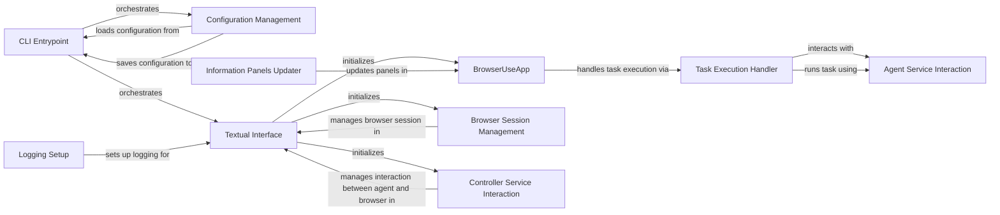

## Component Details

The User Interface component provides the entry point for users to interact with the browser automation system. It encompasses the CLI application setup, configuration management, textual interface, and task execution. The main flow involves loading user configuration, updating it with command-line arguments, setting up the textual interface, handling user input, and orchestrating task execution via the agent service. Its purpose is to present the application to the user, translate user commands into actions within the system, and manage the overall user experience.

### CLI Entrypoint
The CLI Entrypoint component is responsible for orchestrating the entire command-line application. It loads user configurations, updates them with command-line arguments, saves the updated configuration, and initiates the textual interface. This component serves as the starting point for the application's execution.
- **Related Classes/Methods**: `browser_use.browser_use.cli:main`

### Configuration Management
The Configuration Management component handles loading, saving, and managing user configurations. It loads configurations from a file or uses default settings, updates them with command-line arguments, and saves any changes made during the session. This ensures that user preferences are persisted across sessions.
- **Related Classes/Methods**: `browser_use.browser_use.cli:load_user_config`, `browser_use.browser_use.cli:save_user_config`, `browser_use.browser_use.cli:get_default_config`, `browser_use.browser_use.cli:update_config_with_click_args`

### Textual Interface
The Textual Interface component sets up and runs the textual user interface using the Textual library. It initializes the BrowserSession, Controller, and BrowserUseApp, and handles logging. This component provides the visual interface through which users interact with the application.
- **Related Classes/Methods**: `browser_use.browser_use.cli:textual_interface`

### BrowserUseApp
The BrowserUseApp component is the main Textual application class. It handles user input, updates the UI, and orchestrates task execution. It manages the overall application state and responds to user interactions within the textual interface.
- **Related Classes/Methods**: `browser_use.browser_use.cli.BrowserUseApp`

### Logging Setup
The Logging Setup component configures rich logging for the textual interface, setting up log levels and formatters. It uses a custom formatter to provide detailed and informative log messages within the application.
- **Related Classes/Methods**: `browser_use.browser_use.cli.BrowserUseApp:setup_richlog_logging`, `browser_use.logging_config.addLoggingLevel`

### Task Execution Handler
The Task Execution Handler component manages the execution of tasks submitted by the user. It updates the information panels, interacts with the Agent service to add and run the task, and handles any necessary UI updates during task execution.
- **Related Classes/Methods**: `browser_use.browser_use.cli.BrowserUseApp:run_task`, `browser_use.browser_use.cli.BrowserUseApp:on_input_submitted`

### Information Panels Updater
The Information Panels Updater component updates the information panels in the textual interface, including the browser, model, and tasks panels. It provides real-time feedback to the user about the application's state and progress.
- **Related Classes/Methods**: `browser_use.browser_use.cli.BrowserUseApp:update_info_panels`

### Agent Service Interaction
The Agent Service Interaction component represents the interaction with the agent service, which is responsible for managing and running tasks. It receives tasks from the BrowserUseApp and executes them, coordinating with other services as needed.
- **Related Classes/Methods**: `browser_use.agent.service.Agent`

### Browser Session Management
The Browser Session Management component manages the browser session, handling interactions with the browser. It is initialized and closed by the textual_interface and provides the necessary functionality for interacting with the browser during task execution.
- **Related Classes/Methods**: `browser_use.browser.session.BrowserSession`

### Controller Service Interaction
The Controller Service Interaction component represents the interaction with the controller service, which manages the interaction between the agent and the browser. It is initialized by the textual_interface and provides the necessary functionality for coordinating the agent and browser during task execution.
- **Related Classes/Methods**: `browser_use.controller.service.Controller`